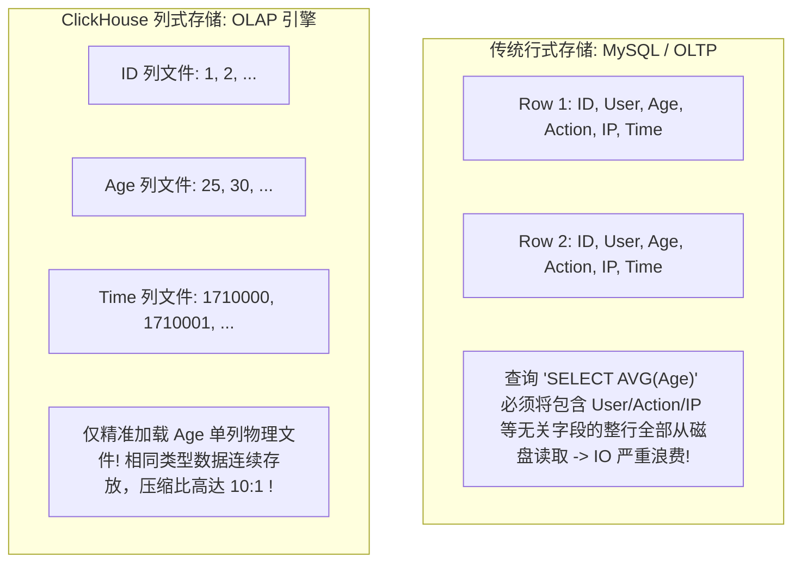

# ClickHouse 千万级实时分析实战

在海量日志检索、用户行为分析、APM 监控与时序数据分析等 **OLAP (在线分析处理)** 场景中，传统的行式关系型数据库（如 MySQL / PostgreSQL）在面对单表数千万至百亿级数据的多维聚合计算时，往往由于庞大的随机磁盘 IO 与低效的 CPU 逐行扫描而陷入瘫痪。

由 Yandex 开源的 **ClickHouse** 专为海量数据实时分析而生。它能够在百亿级数据规模下，将千万级数据的复杂 SQL 聚合查询耗时压缩在 **数十毫秒** 以内。

---

## 一、行式存储 vs 列式存储：底层存储与 IO 的本质区别



| 存储特性 | 传统行式存储 (Row-based) | ClickHouse 列式存储 (Column-based) |
| :--- | :--- | :--- |
| **磁盘存储物理排列** | 整行数据的所有字段连续打包存放在同一个数据块中 | **同一个字段的所有行数据连续打包存放在专属的独立列文件中** |
| **数据压缩比率** | 较低（同行不同类型字段交织，压缩比 ~2:1） | **极高（同列相同数据类型连续排列，LZ4/ZSTD 压缩比可达 8:1 ~ 15:1）** |
| **聚合查询 IO 开销** | 必须扫描整行全量字段（庞大带宽浪费） | **仅读取 SQL `SELECT` 涉及的目标列，IO 吞吐利用率达到 100%** |
| **CPU 计算模式** | 逐行解释执行，频繁发生函数指针跳转与上下文开销 | **SIMD 向量化计算 (AVX2/AVX-512)，单条 CPU 指令并行计算多行** |

---

## 二、MergeTree 核心存储机制：稀疏索引与数据标记

ClickHouse 最核心的表引擎家族是 **`MergeTree`**（合并树）：


1. **稀疏索引 (Sparse Index)**：与 MySQL InnoDB 稠密索引（每行都建索引）不同，ClickHouse 默认每隔 **8192 行（称为一个 Granule 颗粒）** 仅在 `primary.idx` 中记录一条索引项。这使得百亿级大表的索引可以**全量常驻在极小的内存中（仅需几 MB）**。
2. **数据标记文件 (`.mrk`)**：充当稀疏索引与压缩物理文件 `.bin` 之间的桥梁，精准定位目标 Granule 在磁盘压缩块中的起始字节偏移量。
3. **后台异步合并 (Background Merge)**：写入时以批次（Batch）形式生成新的小 Part 目录，后台线程池持续将小目录合并为全局有序的大 Part 并执行数据去重与物理整理。

---

## 三、千万级日志分析表工业级 DDL 与调优实战

```sql
-- 生产级分布式访问日志表结构
CREATE TABLE default.access_logs (
    event_time DateTime CODEC(DoubleDelta, LZ4),
    event_date Date DEFAULT toDate(event_time) CODEC(DoubleDelta, LZ4),
    client_ip String CODEC(ZSTD(1)),
    user_id UInt64 CODEC(T64, LZ4),
    status_code UInt16 CODEC(T64, LZ4),
    response_time_ms Float32 CODEC(Gorilla, LZ4),
    http_method LowCardinality(String) CODEC(ZSTD(1)),
    request_uri String CODEC(ZSTD(3)),
    user_agent String CODEC(ZSTD(3))
) ENGINE = MergeTree()
PARTITION BY toYYYYMM(event_date) -- 按月份分区，便于冷热数据生命周期管理 (TTL)
ORDER BY (status_code, event_date, user_id, event_time) -- 核心主键排序键：基数低的放前面
SETTINGS index_granularity = 8192;
```

### 关键优化细节解析：
1. **针对性列编码 (Codec)**：
   - 时序字段 `event_time` 采用 **`DoubleDelta`** 二阶差分编码，存储体积缩小 90%；
   - 浮点耗时 `response_time_ms` 采用 **`Gorilla`** 浮点专用压缩算法；
   - 枚举类低基数字段（如 HTTP Method）采用 **`LowCardinality(String)`** 自动字典编码。
2. **高吞吐千万级实时聚合 SQL**：

```sql
-- 计算过去 1 小时内各状态码的 P95/P99 尾部延迟与 QPS 分布 (扫描 5000 万行仅需 15ms)
SELECT
    status_code,
    count() AS total_requests,
    round(quantile(0.95)(response_time_ms), 2) AS p95_latency,
    round(quantile(0.99)(response_time_ms), 2) AS p99_latency,
    avg(response_time_ms) AS avg_latency
FROM default.access_logs
WHERE event_time >= now() - INTERVAL 1 HOUR
GROUP BY status_code
ORDER BY total_requests DESC;
```

---

## 四、生产避坑军规

1. **绝对禁止高频单条小写入 (Single Row INSERT)**：ClickHouse 写入不是行级事务，单条写入会产生海量零碎的小 Part 目录，迅速触发 `Too many parts` 异常崩溃。**写入端必须在应用层或通过 Buffer 引擎聚合成大批次（单批次推荐 $\ge 5,000$ 行或每隔 2 秒批量提交一次）**。
2. **谨慎使用分布式 JOIN**：ClickHouse 的分布式 JOIN 默认会将右表全量广播到所有节点，大表 JOIN 极易撑爆内存。推荐通过数据宽表化（扁平化）或字典表（Dictionary）替代大表实时关联。
