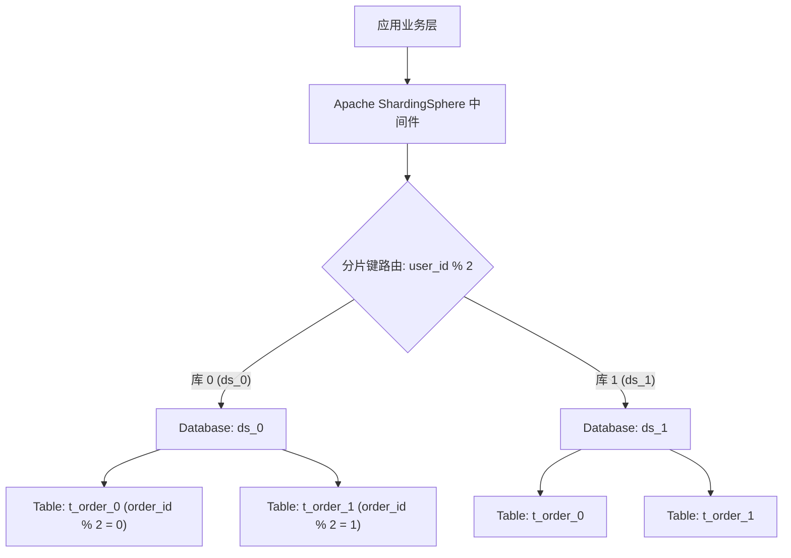

# ShardingSphere 分库分表实战

在现代互联网电商与金融交易平台中，随着业务爆发式增长，单张订单表或流水表的数据量往往在数月内突破数千万乃至数十亿行。在如此巨大的规模下，关系型数据库（如 MySQL InnoDB）的 B+ 树索引层级将从 3 层深度增加至 4 层以上，导致磁盘 IO 剧烈放大，单点 CPU 与连接数成为整个系统的瓶颈。

**分库分表 (Database Sharding)** 是解决这一吞吐与存储极限的核心技术手段。本文将全面拆解水平分片、**Apache ShardingSphere** 路由内核以及**分布式全局唯一 ID (Snowflake)** 的工业级实现。

---

## 一、分库分表核心维度与水平切分架构



### 分片键 (Sharding Key) 黄金选型原则：
1. **最高频业务维度优先**：在 C 端电商场景中，90% 以上的查询带有 `user_id`（如查询“我的订单列表”），因此以 `user_id` 作为分库键能确保单用户的所有订单聚合在同一物理库中，**完全避免跨库广播查询 (Broadcast Query)**。
2. **复合基因法**：若 B 端商家同时需要通过 `order_id` 高频查询，可将 `user_id` 的后 4 位二进制特征基因直接嵌入到全局生成的 `order_id` 低位中，实现根据 `order_id` 亦可精准逆向反推出目标数据库分片。

---

## 二、分布式全局唯一 ID：雪花算法 (Snowflake) 与时钟回拨防御

在分库分表后，单机数据库的自增主键（`AUTO_INCREMENT`）彻底失效。**Twitter Snowflake (雪花算法)** 生成的 64 位（8 字节）长整型数字，具备**趋势递增、高性能、不依赖外部网络**的优势：

```text
 0 - 0000000000 0000000000 0000000000 0000000000 0 - 00000 00000 - 000000000000
 ^   -------------------------------------------   -----------   ------------
 1位                41位 时间戳 (毫秒)              10位 机器/数据中心ID  12位 序列号
 符号位             (支持系统使用 69 年)             (支持 1024 节点)   (单毫秒支持 4096 个ID)
```

### 生产级 Go 语言防时钟回拨雪花算法实现：

```go
package snowflake

import (
	"errors"
	"sync"
	"time"
)

const (
	epoch             = int64(1704067200000) // 自定义起始时间戳 (2024-01-01)
	workerBits        = uint(10)             // 机器码位数 (支持 1024 节点)
	sequenceBits      = uint(12)             // 序列号位数 (支持 4096/ms)
	maxWorkerId       = int64(-1 ^ (-1 << workerBits))
	maxSequence       = int64(-1 ^ (-1 << sequenceBits))
	timeShift         = workerBits + sequenceBits
	workerShift       = sequenceBits
	maxClockBackwards = 5 * time.Millisecond // 允许的最大时钟回拨等待时间
)

type SnowflakeGenerator struct {
	mu           sync.Mutex
	lastTimestamp int64
	workerId     int64
	sequence     int64
}

func NewSnowflakeGenerator(workerId int64) (*SnowflakeGenerator, error) {
	if workerId < 0 || workerId > maxWorkerId {
		return nil, errors.New("worker id out of valid range")
	}
	return &SnowflakeGenerator{workerId: workerId}, nil
}

func (s *SnowflakeGenerator) NextId() (int64, error) {
	s.mu.Lock()
	defer s.mu.Unlock()

	current := time.Now().UnixMilli()

	// 1. 【核心安全防御】：检测系统 NTP 时钟回拨 (Clock Backwards)
	if current < s.lastTimestamp {
		offset := s.lastTimestamp - current
		if offset <= int64(maxClockBackwards/time.Millisecond) {
			// 回拨较小时，主动休眠追平时间戳
			time.Sleep(time.Duration(offset) * time.Millisecond)
			current = time.Now().UnixMilli()
		} else {
			return 0, errors.New("clock moved backwards severely, refusing to generate id")
		}
	}

	if current == s.lastTimestamp {
		// 同一毫秒内自增序列号
		s.sequence = (s.sequence + 1) & maxSequence
		if s.sequence == 0 {
			// 当前毫秒序列号已耗尽 (超过 4096)，自旋等待至下一毫秒
			for current <= s.lastTimestamp {
				current = time.Now().UnixMilli()
			}
		}
	} else {
		s.sequence = 0 // 新的毫秒重置序列号
	}

	s.lastTimestamp = current

	// 2. 位运算拼装生成 64 位全局唯一 ID
	id := ((current - epoch) << timeShift) |
		(s.workerId << workerShift) |
		s.sequence

	return id, nil
}
```

---

## 三、Apache ShardingSphere 生产配置与路由优化

使用标准 YAML 声明分片规则：

```yaml
# shardingsphere-config.yaml
rules:
- !SHARDING
  tables:
    t_order:
      actualDataNodes: ds_${0..1}.t_order_${0..1} # 2个库 x 2张表 = 共4张物理分表
      databaseStrategy:
        standard:
          shardingColumn: user_id
          shardingAlgorithmName: db_inline
      tableStrategy:
        standard:
          shardingColumn: order_id
          shardingAlgorithmName: tbl_inline
      keyGenerateStrategy:
        column: order_id
        keyGeneratorName: snowflake_gen

  shardingAlgorithms:
    db_inline:
      type: INLINE
      props:
        algorithm-expression: ds_${user_id % 2}
    tbl_inline:
      type: INLINE
      props:
        algorithm-expression: t_order_${order_id % 2}
```

---

## 四、分库分表避坑清单

1. **规避跨分片分页查询 (`ORDER BY create_time LIMIT 100000, 20`)**：跨库深分页会导致中间件将所有分表的全部前 10 万行数据拉入内存归并，极易 OOM。**务必使用“滚动游标分页 (Seek Method)”：`WHERE id > last_seen_id ORDER BY id ASC LIMIT 20`**。
2. **禁止跨库分布式 JOIN**：将高频字典表（如城市表、商品类别表）配置为 ShardingSphere 的 **广播表 (Broadcast Table)**，在每个数据库物理实例中均保留全量同步副本。
