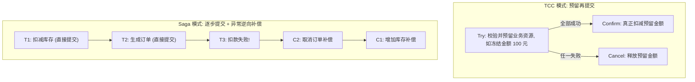
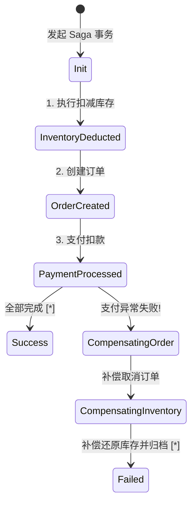

# 分布式事务：Saga 与 TCC 方案选型

在单体应用时代，借助关系型数据库提供的 ACID 本地事务，开发者可以轻松保证数据一致性。然而，当单体拆分为分布式微服务集群、单个业务操作跨越多个独立数据库甚至第三方外部系统（如微信/支付宝支付）时，经典的单机事务彻底失效。

虽然强一致性的 **2PC (两阶段提交) / XA 规范** 能提供严格的一致性保证，但其长事务期间对全局资源的行级锁死，会导致系统吞吐量呈断崖式下跌。在追求高吞吐与高可用的互联网架构中，**基于 BASE 理论的最终一致性方案（TCC 与 Saga）** 成为了主流选择。

---

## 一、主流分布式事务模式横向对比矩阵

| 事务模式 | 一致性级别 | 性能与吞吐量 | 业务侵入性 | 资源锁定范围 | 核心适用场景 |
| :--- | :--- | :--- | :--- | :--- | :--- |
| **2PC / XA** | 强一致 (CP) | 极低（全局阻塞锁） | 极低（DB 层自动支持） | 阶段一至阶段二完成全程加锁 | 金融核心总账、跨库绝对严密转账 |
| **TCC** | 最终一致 (AP) | **高**（仅预留锁定资源） | **极高**（需编写 Try/Confirm/Cancel 三个接口） | 仅在 Try 阶段冻结特定业务配额 | 强时效性支付结账、库存预扣与扣减 |
| **Saga** | 最终一致 (AP) | **极高**（无任何预留锁） | 中等（需编写正向执行与对应补偿接口） | 无资源锁定，直接提交本地事务 | 长事务链路、涉及三方外部系统的复杂业务 |
| **本地消息表 / 事务消息** | 最终一致 (AP) | **极高**（完全异步解耦） | 较低（基于 MQ 消息重试） | 仅本地事务级别短锁 | 异步发券、积分结算、跨域通知 |



---

## 二、TCC 核心落地三大难题与代码防线

编写 TCC 接口时，必须在代码层面严格防御由于网络抖动引起的 **空回滚**、**防悬挂** 与 **幂等控制**：

```typescript
// services/AccountTccService.ts
import { db } from '@/lib/db';

export class AccountTccService {
  /**
   * 1. Try 阶段：冻结资金
   */
  async tryDeduct(txId: string, userId: string, amount: number): Promise<boolean> {
    return await db.transaction(async (tx) => {
      // 检查防悬挂记录：如果 Cancel 已经先于 Try 到达，则拒绝执行 Try
      const log = await tx.tccLog.findUnique({ where: { txId } });
      if (log && log.status === 'CANCELLED') {
        throw new Error('Suspension detected: Cancel already arrived before Try!');
      }

      // 检查可用余额
      const account = await tx.account.findUnique({ where: { userId } });
      if (!account || account.balance < amount) {
        throw new Error('Insufficient balance');
      }

      // 扣减可用余额，增加冻结金额
      await tx.account.update({
        where: { userId },
        data: {
          balance: { decrement: amount },
          frozen: { increment: amount },
        },
      });

      // 记录 Try 执行成功日志
      await tx.tccLog.create({
        data: { txId, userId, amount, status: 'TRIED' },
      });

      return true;
    });
  }

  /**
   * 2. Confirm 阶段：扣除冻结资金
   */
  async confirmDeduct(txId: string, userId: string, amount: number): Promise<void> {
    await db.transaction(async (tx) => {
      const log = await tx.tccLog.findUnique({ where: { txId } });
      if (!log || log.status === 'CONFIRMED') {
        return; // 幂等性：已确认过则直接返回
      }

      // 正式扣除冻结金额
      await tx.account.update({
        where: { userId },
        data: { frozen: { decrement: amount } },
      });

      await tx.tccLog.update({
        where: { txId },
        data: { status: 'CONFIRMED' },
      });
    });
  }

  /**
   * 3. Cancel 阶段：解冻资金
   */
  async cancelDeduct(txId: string, userId: string, amount: number): Promise<void> {
    await db.transaction(async (tx) => {
      const log = await tx.tccLog.findUnique({ where: { txId } });

      // 空回滚处理：如果 Try 从未执行过（网络超时丢包），记录 CANCELLED 状态以防悬挂
      if (!log) {
        await tx.tccLog.create({
          data: { txId, userId, amount, status: 'CANCELLED' },
        });
        return;
      }

      if (log.status === 'CANCELLED') return; // 幂等

      // 释放冻结资金回滚给用户
      await tx.account.update({
        where: { userId },
        data: {
          balance: { increment: amount },
          frozen: { decrement: amount },
        },
      });

      await tx.tccLog.update({
        where: { txId },
        data: { status: 'CANCELLED' },
      });
    });
  }
}
```

---

## 三、Saga 编排器 (Orchestrator) 状态机架构

对于长链条业务（如订机票 -> 订酒店 -> 订租车），推荐采用**集中编排式 Saga (Orchestrator)**：



---

## 四、生产选型黄金法则

1. **涉及核心资金且强时效业务**（如外卖接单扣款、抢购秒杀预占额度）：**坚决选用 TCC 模式**，通过预留冻结保证隔离性。
2. **长流程业务、老系统无侵入集成、或涉及第三方外部接口**：**选用 Saga 编排模式**。
3. **跨系统最终通知、积分发放、数据统计归档**：**选用 MQ 本地消息表 / 事务消息**，实现最高吞吐与异步解耦。
