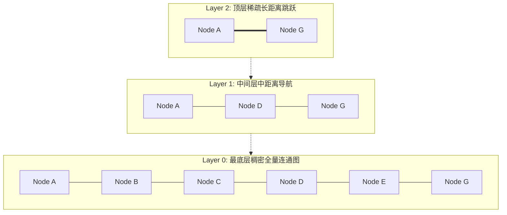

# Elasticsearch 向量检索与 RAG 实战

随着生成式人工智能（AIGC）的普及，**RAG (Retrieval-Augmented Generation，检索增强生成)** 已经成为解决大模型“知识库滞后”、“专业私有领域盲区”与“事实性幻觉（Hallucination）”的核心架构模式。

传统的全文检索（如 BM25 词频统计）依赖精确的关键字字面匹配，在面对同义词、模糊意图或语义理解时常发生漏召回；而单一的向量检索在面对专有名词、产品型号、精确编码时又容易产生偏差。

**Elasticsearch 8.x+** 引入了原生的 **密集向量检索 (Dense Vector)** 与 **HNSW 索引算法**，使团队无需引入额外的专用向量数据库，即可实现 **BM25 + 向量相似度的高性能混合检索 (Hybrid Search)**。

---

## 一、RAG 核心处理链路与数据流转

```mermaid
graph TD
    subgraph Offline_Indexing ["离线知识入库流程"]
        Docs[企业私有文档 PDF / Markdown] --> ChunkSplit["文本智能切片 (Chunking: 500 Tokens)"]
        ChunkSplit --> EmbedModel["Embedding 嵌入模型 (如 text-embedding-3-small)"]
        EmbedModel --> ESIndex["Elasticsearch: 存储 文本 + 1536维向量 并构建 HNSW 图索引"]
    end

    subgraph Online_RAG_Query ["在线混合检索与生成流程"]
        UserQ["用户提问: 如何配置微服务的熔断阈值?"] --> QEmbed[生成 Query 向量]
        QEmbed --> HybridSearch["ES 混合检索: BM25 关键字 + Dense Vector 语义"]
        HybridSearch --> RRF["RRF 倒数排名融合算法 -> 召回 Top-3 最优文档片段"]
        RRF --> PromptAugment["构建增强 Prompt: 上下文 Context + 原始提问"]
        PromptAugment --> LLMGen[大模型推理生成精准无幻觉回答]
    end
```



---

## 二、HNSW (层次化可导航小世界) 算法底层原理解析

传统的暴力向量检索（KNN）需要计算目标向量与库中所有向量的欧氏距离或余弦夹角，时间复杂度高达 $O(N)$，在千万级数据量下无法满足实时交互需求。

**HNSW (Hierarchical Navigable Small World)** 图索引借鉴了“跳表 (SkipList)”的多层设计思想：



1. **多层图跳跃寻址**：从最高层稀疏图开始检索，以超长步长快速逼近目标向量附近的局部区域；
2. **逐层向下收敛**：随着层数下潜，节点密度递增，执行细粒度的近邻局部搜索；
3. **复杂度降维**：将向量近邻检索的时间复杂度从 $O(N)$ 优化至 **$O(\log N)$**，毫秒级完成千万级向量召回。

---

## 三、Elasticsearch 向量映射与混合检索实战

### 1. 建立支持向量与全文索引的 Mapping：

```json
PUT /enterprise_knowledge_base
{
  "mappings": {
    "properties": {
      "title": { "type": "text" },
      "content": { 
        "type": "text",
        "analyzer": "ik_max_word"
      },
      "content_vector": {
        "type": "dense_vector",
        "dims": 1536,
        "index": true,
        "similarity": "cosine",
        "index_options": {
          "type": "hnsw",
          "m": 16,
          "ef_construction": 100
        }
      },
      "category": { "type": "keyword" },
      "updated_at": { "type": "date" }
    }
  }
}
```

### 2. 执行 RRF (Reciprocal Rank Fusion) 混合检索：

```json
POST /enterprise_knowledge_base/_search
{
  "retriever": {
    "rrf": {
      "retrievers": [
        {
          "standard": {
            "query": {
              "match": {
                "content": "微服务 熔断配置"
              }
            }
          }
        },
        {
          "knn": {
            "field": "content_vector",
            "query_vector": [0.012, -0.045, 0.089, "...共1536维..."],
            "k": 10,
            "num_candidates": 100
          }
        }
      ],
      "rank_constant": 60,
      "rank_window_size": 10
    }
  }
}
```

---

## 四、生产级 RAG 关键质量调优技巧

1. **分块策略重于模型本身 (Chunking Strategy)**：切分文本时务必设置 **Overlap (重叠窗口，如 15%~20%)**，防止切片恰好切断关键句子的语义上下文。
2. **重排序机制 (Re-ranking)**：在 ES 召回 Top-20 文档后，使用交叉编码器模型（Cross-Encoder，如 Cohere Rerank / BGE-Reranker）进行二次精排打分，将最相关的 3~5 个片段送入大模型，回答准确率可提升 35% 以上。
