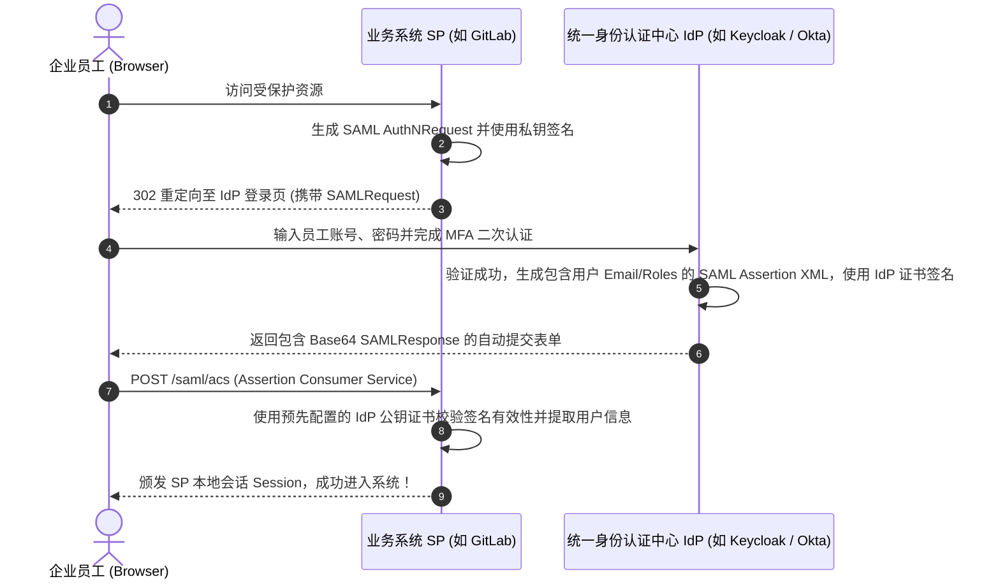

# SAML 2.0 与 OIDC 单点登录中台实战

在大型企业信息化建设中，员工日常需要访问数十套内部与外部业务系统（如 Jira、GitLab、飞书、Salesforce、内部财务与 HR 系统）。如果每个系统各自维护一套独立的账号密码体系，不仅员工体验极差，更会带来灾难性的安全合规风险（例如员工离职后无法一键吊销所有系统的访问权限）。

**单点登录 (Single Sign-On, SSO)** 通过建立统一的 **身份提供商 (Identity Provider, IdP)**，允许用户“一次登录，畅行所有服务”。在企业级传统系统与现代云服务中，**SAML 2.0** 与 **OIDC (OpenID Connect)** 是最重要的两大标准协议。

---

## 一、SAML 2.0 vs OIDC 核心协议特性深度对比

| 协议维度 | SAML 2.0 (Security Assertion Markup Language) | OIDC (OpenID Connect) |
| :--- | :--- | :--- |
| **数据载体与编码** | 基于 XML 与 Base64 编码的 **SAML Assertion 断言** | 基于 **JSON Web Token (JWT)** 的轻量级签名载荷 |
| **传输通道支持** | 主要通过 HTTP POST Binding 与 HTTP Redirect 浏览器重定向 | 完美支持浏览器、移动端 App、SPA 单页与服务端 API |
| **加密与签名机制** | 基于 XML-DSig 与 X.509 公私钥证书体系 | 基于标准 JWS (JSON Web Signature) 与 RSA/ECDSA 算法 |
| **历史与生态定位** | 历史悠久，传统政企、大型成熟 SaaS（Okta, Azure AD, Salesforce）标配 | 现代互联网应用、微服务 API 鉴权事实标准 |



---

## 二、SAML 2.0 核心断言 XML 结构解析

```xml
<samlp:Response xmlns:samlp="urn:oasis:names:tc:SAML:2.0:protocol" ID="_resp_12345" Version="2.0">
  <saml:Issuer xmlns:saml="urn:oasis:names:tc:SAML:2.0:assertion">https://sso.enterprise.org/idp</saml:Issuer>
  <samlp:Status>
    <samlp:StatusCode Value="urn:oasis:names:tc:SAML:2.0:status:Success"/>
  </samlp:Status>

  <!-- 核心断言载荷 -->
  <saml:Assertion xmlns:saml="urn:oasis:names:tc:SAML:2.0:assertion" ID="_assert_9988">
    <saml:Subject>
      <!-- 用户唯一身份标识 NameID -->
      <saml:NameID Format="urn:oasis:names:tc:SAML:1.1:nameid-format:emailAddress">
        staff.alex@enterprise.org
      </saml:NameID>
    </saml:Subject>

    <!-- 员工属性集 (Roles, Department) -->
    <saml:AttributeStatement>
      <saml:Attribute Name="Department">
        <saml:AttributeValue>Infrastructure-Engineering</saml:AttributeValue>
      </saml:Attribute>
      <saml:Attribute Name="Role">
        <saml:AttributeValue>Security-Auditor</saml:AttributeValue>
      </saml:Attribute>
    </saml:AttributeStatement>
  </saml:Assertion>
</samlp:Response>
```

---

## 三、Node.js / Express 业务端 (SP) 对接 SAML 实战

使用开源标准的 `passport-saml` 进行快速安全的 SP 侧集成：

```typescript
// sso/saml-strategy.ts
import passport from 'passport';
import { Strategy as SamlStrategy } from 'passport-saml';
import fs from 'node:fs';

export function setupSamlAuth() {
  passport.use(
    new SamlStrategy(
      {
        path: '/login/callback', // SP 侧 ACS 接收回调路由
        entryPoint: 'https://sso.enterprise.org/saml2/idp/sso', // IdP 登录入口
        issuer: 'https://my-internal-app.corp.local', // SP Entity ID
        // 关键安全配置：IdP 公钥证书，用于严密防篡改验签
        cert: fs.readFileSync('./certs/idp-public-cert.pem', 'utf-8'),
        // SP 自身私钥，用于签名发出的 AuthNRequest
        privateKey: fs.readFileSync('./certs/sp-private-key.pem', 'utf-8'),
        signatureAlgorithm: 'sha256',
        acceptedClockSkewMs: 5000, // 允许 5 秒的时钟漂移误差
      },
      (profile: any, done: any) => {
        // 验签通过后，提取并映射本地用户数据库对象
        const user = {
          email: profile.nameID,
          department: profile.Department,
          roles: profile.Role ? [profile.Role] : [],
        };
        return done(null, user);
      }
    )
  );
}
```

---

## 四、企业级 SSO 核心安全防御原则

1. **严格校验 `InResponseTo` 字段**：SP 在校验 SAML 断言时，必须核对该断言是否与自己发起的特定 `AuthNRequest ID` 匹配，彻底防御伪造断言的 **SAML 重放攻击 (Replay Attack)**。
2. **强制开启 XML 数字签名与时间戳校验 (`NotOnOrAfter`)**：严禁关闭签名校验，断言有效期通常控制在 5 分钟以内。
3. **单点登出 (Single Logout, SLO)**：建立统一的 SLO 广播通道，当员工在 IdP 点击“退出登录”时，通过 WebSocket 或 SAML LogoutRequest 同步销毁所有接入子系统的 Session 凭证。
