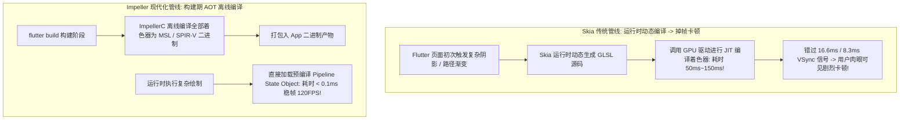

# Flutter 3 Impeller 渲染引擎深度剖析

在跨平台 UI 框架的发展史中，**Flutter** 凭借“自带渲染引擎、像素级自绘、高性能 Skia 支撑”迅速风靡全球。然而，早期基于 Skia 引擎的 Flutter 应用在 iOS 和高刷 Android 设备上一直饱受一个顽疾的困扰：**首次动画或复杂转场时出现的偶发性严重掉帧卡顿（俗称 Shader Compilation Jank，着色器编译卡顿）**。

为了彻底根治这一体验死穴，Flutter 官方团队自底向上打造了全新的图形渲染引擎 —— **Impeller**。本文将深入剖析 Impeller 的核心渲染管线与其消除卡顿的底层奥秘。

---

## 一、Skia 着色器卡顿 (Shader Jank) 的物理根因

在传统的 Skia 渲染管线中，着色器程序（Shader）是在应用**运行时动态生成并即时编译 (JIT)** 的：



---

## 二、Impeller 核心架构四大支柱

| 架构特性 | 早期 Skia 引擎 | 次时代 Impeller 引擎 |
| :--- | :--- | :--- |
| **着色器编译时机** | 应用运行时动态 JIT 编译 | **构建期 AOT (Ahead-of-Time) 离线预编译** |
| **底层硬件 API 绑定** | 基于古老的 OpenGL 抽象层 | 原生直连 **Metal (iOS/macOS)** 与 **Vulkan (Android)** |
| **内存与并发模型** | 单一主栅格化线程瓶颈 | **多线程并行生成渲染指令**，充分利用多核 GPU 队列 |
| **着色器类型安全** | 运行时字符串拼接 GLSL，易发生驱动崩溃 | **强类型 C++ 反射头文件自动生成**，编译期捕捉着色器参数错误 |

---

## 三、ImpellerC 离线编译工具链机制

在执行 `flutter build apk` 或 `flutter build ipa` 时，**`impellerc`** 编译器会将每一个 GLSL/HLSL 着色器编译为目标平台的原生着色器代码：
- 在 iOS 平台上输出为 **Metal Shading Language (MSL)** 字节码；
- 在 Android 平台上输出为 **SPIR-V** 二进制中间格式。

并且，`impellerc` 会自动生成强类型的 C++ 绑定头文件，使 Flutter 引擎代码能够像调用普通函数一样类型安全地绑定 Uniform 变量与纹理，彻底杜绝了动态查表开销。

---

## 四、生产性能诊断与 Impeller 开启验证

在现代 Flutter 3.x+ 中，iOS 已经默认全面启用 Impeller，Android 平台可通过编译参数显式启用：

```bash
# 运行并开启 Impeller 引擎与性能监控浮层
flutter run --enable-impeller --show-fps
```

在 AndroidManifest.xml 中显式配置：

```xml
<application>
  <meta-data
    android:name="io.flutter.embedding.android.EnableImpeller"
    android:value="true" />
</application>
```

### DevTools 帧耗时性能比对：

在复杂粒子列表滚动压测下，打开 Flutter DevTools 的 **Performance** 视图：
- **Skia 引擎**：首帧 Shader Compilation 耗时峰值高达 **85 ms**，触发长红色警告条。
- **Impeller 引擎**：全程无任何 Shader 编译标记，单帧渲染耗时均值稳定在 **3.2 ms**，达成满帧 120Hz 丝滑流畅度。
