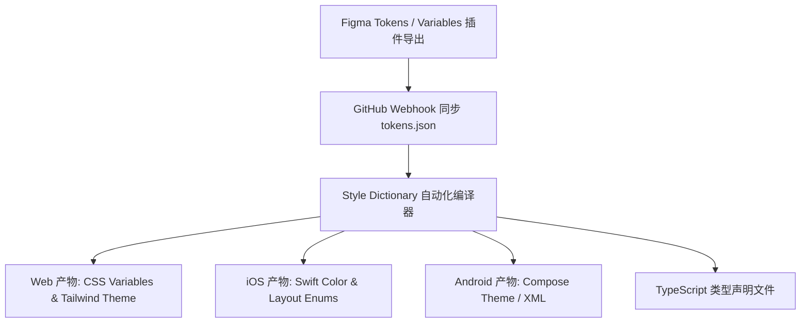

# Design Tokens 跨端设计系统交付实践

在多端协作（Web、H5、iOS、Android、小程序）的企业级研发场景中，设计规范与代码实现脱节是长期存在的顽疾：设计团队在 Figma 中调整了主色调或圆角规范，往往需要前端工程师在各个仓库中手动查找替换十几种硬编码常量，极易引发视觉不一致与维护灾难。

**Design Tokens (设计令牌)** 是设计系统的最小原子化事实来源（Single Source of Truth）。结合 **W3C DTCG 规范** 与 **Style Dictionary** 自动化构建工具链，能够实现“Figma 变量变更 -> Git 自动提 PR -> 跨端多平台产物实时生成”的完全无人值守流水线。

---

## 一、Design Tokens 三层分层架构模型

为了兼顾基础色盘的稳定与暗黑模式、主题化（Theming）的灵活切换，业界标准通常采用**三层 Token 抽象**：

| Token 层级 | 命名约定与作用 | 典型示例 (JSON) | 开发者修改频率 |
| :--- | :--- | :--- | :--- |
| **1. Global Tokens (全局基准令牌)** | 定义最底层的原始物理值（色值、字号、间距），无业务语义 | `color.blue.500 = "#3b82f6"`<br>`space.4 = "16px"` | 极低（品牌重塑时变更） |
| **2. Semantic Tokens (语义别名令牌)** | 赋予具体业务场景意图，支持 Light/Dark 模式映射 | `color.bg.surface = "{color.neutral.50}"`<br>`color.text.primary = "{color.neutral.900}"` | 中等（新增主题/无障碍调优） |
| **3. Component Tokens (组件私有令牌)** | 组件内部专用微调变量，直接绑定到语义层 | `btn.primary.bg = "{color.interactive.brand}"`<br>`card.border.radius = "{radius.lg}"` | 高（组件库微调与交互迭代） |



---

## 二、标准 DTCG JSON 结构定义

```json
{
  "color": {
    "brand": {
      "500": {
        "$value": "#2563eb",
        "$type": "color",
        "$description": "主品牌识别蓝色"
      }
    }
  },
  "semantic": {
    "surface": {
      "default": {
        "$value": "#ffffff",
        "$type": "color"
      },
      "dark": {
        "$value": "#0f172a",
        "$type": "color"
      }
    },
    "action": {
      "primary": {
        "$value": "{color.brand.500}",
        "$type": "color"
      }
    }
  },
  "radius": {
    "md": {
      "$value": "8px",
      "$type": "dimension"
    }
  }
}
```

---

## 三、Style Dictionary 自动化构建管线配置

通过 Style Dictionary 将一份 JSON 统一编译为 Web CSS 变量与 TypeScript 强类型常量：

```typescript
// build-tokens.ts
import StyleDictionary from 'style-dictionary';

const sd = new StyleDictionary({
  source: ['tokens/**/*.json'],
  platforms: {
    // 1. Web 平台：生成标准 CSS 变量文件
    css: {
      transformGroup: 'css',
      buildPath: 'dist/css/',
      files: [
        {
          destination: 'variables.css',
          format: 'css/variables',
          options: {
            outputReferences: true, // 保留 var(--semantic-color) 引用链
          },
        },
      ],
    },
    // 2. JS/TS 平台：生成供 Tailwind 与 CSS-in-JS 使用的强类型模块
    ts: {
      transformGroup: 'js',
      buildPath: 'dist/ts/',
      files: [
        {
          destination: 'tokens.ts',
          format: 'javascript/es6',
        },
        {
          destination: 'tokens.d.ts',
          format: 'typescript/es6-declarations',
        },
      ],
    },
  },
});

await sd.buildAllPlatforms();
console.log('✨ All platform Design Tokens compiled successfully!');
```

---

## 四、GitHub Actions 自动化 CI/CD 流程落地

```yaml
# .github/workflows/tokens-sync.yml
name: Design Tokens Pipeline

on:
  push:
    paths:
      - 'tokens/**'
  workflow_dispatch:

jobs:
  build-and-publish:
    runs-on: ubuntu-latest
    steps:
      - uses: actions/checkout@v4
      - uses: pnpm/action-setup@v3
        with:
          version: 9
      - uses: actions/setup-node@v4
        with:
          node-version: 20
          cache: 'pnpm'

      - run: pnpm install --frozen-lockfile
      - name: Compile Tokens to Multi-platform Assets
        run: pnpm run build:tokens

      - name: Publish NPM Package
        run: |
          npm config set //registry.npmjs.org/:_authToken ${{ secrets.NPM_TOKEN }}
          pnpm publish --access public --no-git-checks
```

---

## 五、企业实施要点

1. **命名空间规范化**：严格遵循 `[类别]-[概念]-[属性]-[状态]`（如 `--color-btn-bg-hover`）的命名层级，杜绝无规律的缩写。
2. **渐进式迁移**：现有旧系统无需推倒重来，可在基础公共样式库中先引入 CSS 变量，通过 ESLint 插件逐步禁止代码库中的硬编码 HEX 色值。
