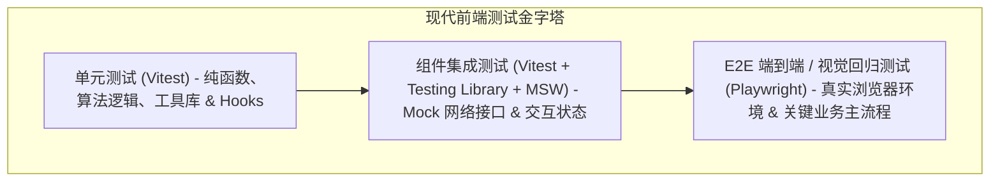

# Vitest 与 Playwright 前端测试实战

在前端应用复杂度日益提升的今天，缺乏自动化测试保障的代码库往往成为团队技术债务的温床。然而，传统的测试工具栈（如 Jest、Babel、ts-jest、Cypress）常因庞大的 Node.js 转换层、重复的配置文件以及龟速的执行体验让开发者望而却步。

由 Vite 驱动的原生单元测试框架 **Vitest** 与微软开源的高性能端到端测试框架 **Playwright**，共同构成了现代 Web 工程的**新一代测试金字塔**。

---

## 一、现代前端测试金字塔分层模型



| 测试类型 | 推荐核心工具 | 验证目标 | 执行速度与成本 |
| :--- | :--- | :--- | :--- |
| **单元测试 (Unit)** | **Vitest** | 验证工具函数、状态管理、自定义 Hook 逻辑的纯净性 | 极快（毫秒级，高并发多线程） |
| **组件测试 (Component)** | **Vitest** + **@testing-library/react** + **MSW** | 验证组件受控属性、用户点击、表单提交与 Mock API 联动 | 较快（Happy-DOM / JSDOM 环境） |
| **端到端测试 (E2E)** | **Playwright** | 跨 Chromium/Firefox/WebKit 真实浏览器验证用户完整购买/注册路径 | 相对耗时（秒级），但信心指数最高 |

---

## 二、Vitest + Testing Library + MSW 组件测试实战

使用 MSW (Mock Service Worker) 在网络层无侵入拦截 API 请求，模拟组件在各种后端返回态（成功、网络抖动、500 错误）下的健壮性：

```tsx
// src/components/UserProfile.test.tsx
import { render, screen, waitFor } from '@testing-library/react';
import userEvent from '@testing-library/user-event';
import { describe, it, expect, beforeAll, afterEach, afterAll } from 'vitest';
import { http, HttpResponse } from 'msw';
import { setupServer } from 'msw/node';
import UserProfile from './UserProfile';

// 1. 设置 MSW 模拟服务端
const server = setupServer(
  http.get('/api/user/me', () => {
    return HttpResponse.json({
      id: 'usr_1024',
      name: 'Alex Developer',
      role: 'Staff Architect',
    });
  }),
  http.post('/api/user/update-status', async ({ request }) => {
    const body = await request.json();
    return HttpResponse.json({ success: true, newStatus: body.status });
  })
);

beforeAll(() => server.listen());
afterEach(() => server.resetHandlers());
afterAll(() => server.close());

describe('<UserProfile />', () => {
  it('应当正确加载并展示初始用户信息', async () => {
    render(<UserProfile />);

    // 初始骨架态
    expect(screen.getByTestId('profile-skeleton')).toBeInTheDocument();

    // 异步数据就绪
    expect(await screen.findByText('Alex Developer')).toBeInTheDocument();
    expect(screen.getByText('Staff Architect')).toBeInTheDocument();
  });

  it('处理网络 500 异常时优雅展现错误回退 UI', async () => {
    // 动态覆盖 Handler
    server.use(
      http.get('/api/user/me', () => {
        return new HttpResponse(null, { status: 500 });
      })
    );

    render(<UserProfile />);
    expect(await screen.findByText(/加载个人信息失败，请稍后重试/i)).toBeInTheDocument();
  });
});
```

---

## 三、Playwright 真实浏览器 E2E 与视觉回归测试

Playwright 支持直接驱动原生浏览器引擎，具备自动等待（Auto-waiting）、网络请求拦截与像素级快照对比能力：

```typescript
// e2e/checkout-flow.spec.ts
import { test, expect } from '@playwright/test';

test.describe('电商核心结账链路验证', () => {
  test.beforeEach(async ({ page }) => {
    // 注入预先登录态 Token 绕过繁琐登录页
    await page.addCookies([
      { name: 'auth_token', value: 'mock_session_token_xyz', domain: 'localhost', path: '/' },
    ]);
  });

  test('用户能够成功将商品加入购物车并完成模拟支付', async ({ page }) => {
    // 1. 访问商品详情页
    await page.goto('/products/macbook-pro-m3');

    // 2. 点击加购 (内置自动等待可见与可点击，无需 sleep)
    const addBtn = page.getByRole('button', { name: /加入购物车/i });
    await addBtn.click();

    // 3. 校验购物车徽标提示数变为 1
    const cartBadge = page.getByTestId('header-cart-badge');
    await expect(cartBadge).toHaveText('1');

    // 4. 跳转结账流程
    await page.goto('/checkout');
    await page.getByLabel(/收货地址/i).fill('上海市浦东新区张江高科技园区 888 号');
    await page.getByRole('button', { name: /确认下单/i }).click();

    // 5. 验证支付成功结果页面
    await expect(page).toHaveURL(/.*\/order\/success/);
    await expect(page.getByRole('heading', { name: /支付成功/i })).toBeVisible();

    // 6. 视觉回归对比：确保订单凭证卡片像素未发生意外偏移
    await expect(page.getByTestId('order-receipt-card')).toHaveScreenshot('receipt-card.png', {
      maxDiffPixels: 20,
    });
  });
});
```

---

## 四、CI/CD 持续集成流水线优化规范

1. **启用 Vitest 内存隔离缓存**：在 CI 中使用 `vitest run --shard=1/2` 结合多容器并行切片执行。
2. **Playwright 痕迹采集 (Trace Viewer)**：在 CI 中配置 `trace: 'on-first-retry'`，当测试用例偶发失败时，自动保存包含 DOM 树快照、网络瀑布流与操作录像的 zip 文件，实现本地 1 秒精准定位复现。
