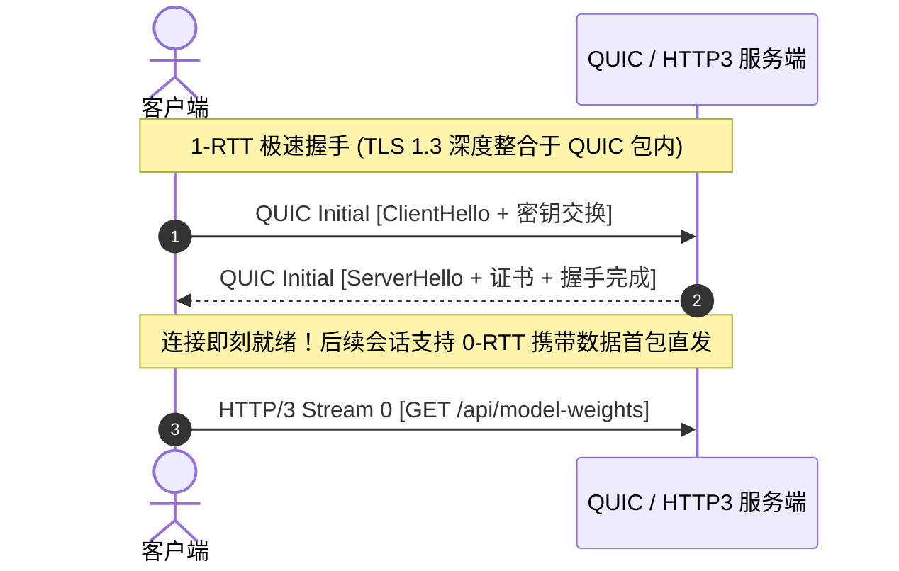

# HTTP/3、WebTransport 与 WebGPU 全解

过去三十年，Web 平台从最初的静态超文本系统演变为如今承载着 AI 大模型客户端推理、3D 云渲染、元宇宙协作与高频实时交易的通用分布式计算平台。

然而，传统的 Web 基础设施在底层协议和计算能力上正逼近物理极限：TCP 队头阻塞制约了实时性，WebSocket 缺乏不可靠多路复用，WebGL 的 CPU-GPU 驱动开销限制了渲染算力。**HTTP/3 (QUIC)**、**WebTransport** 与 **WebGPU** 构成了重塑 Web 生态的“新三角基础设施”。

---

## 一、HTTP/3 QUIC：彻底消除传输层队头阻塞

HTTP/2 虽然在应用层实现了 Stream 多路复用，但底层仍基于单一 TCP 连接。一旦网络发生微小的丢包，TCP 的滑动窗口确认机制会强制阻塞整个连接上的所有 Stream 直至丢包重传完成。

**HTTP/3 基于 UDP 的 QUIC (Quick UDP Internet Connections) 协议** 从根本上消除了这一枷锁：

| 协议特性 | HTTP/1.1 (TCP) | HTTP/2 (TCP) | HTTP/3 (QUIC / UDP) |
| :--- | :--- | :--- | :--- |
| **连接建立耗时** | 1.5 - 2 RTT (TCP + TLS 1.2) | 1 - 2 RTT (TCP + TLS 1.3) | **0-RTT (连接恢复) / 1-RTT** |
| **队头阻塞 (HoL)** | 存在（请求排队阻塞） | 传输层存在（单包丢失阻塞全量 Stream） | **完全不存在**（各 Stream 独立确认） |
| **连接迁移能力** | IP/端口变更（如 WiFi 切 4G）立即断连 | 立即断连重连 | **无缝平滑迁移**（基于 64 位 Connection ID） |



---

## 二、WebTransport：取代 WebSocket 的次时代实时通信

WebSocket 仅支持单一可靠的 TCP 流，在多人在线游戏、实时音视频标注或协同遥测场景下，高频非关键数据（如鼠标移动坐标）若发生丢包，会强行阻塞后续最新的状态包。

**WebTransport** 基于 HTTP/3 提供了两种维度的原语通信：
1. **Unreliable Datagrams (不可靠数据报)**：类似 UDP，零重传开销，最适合超低延迟场景。
2. **Streams (单向 / 双向可靠流)**：多条独立流并发传输，互不干扰。

### 客户端 WebTransport 极速通信代码：

```typescript
// 建立 WebTransport 双向低延迟会话
async function initWebTransport(url: string) {
  const transport = new WebTransport(url);
  await transport.ready;
  console.log('⚡ WebTransport session established!');

  // 1. 发送不可靠超低延迟 Datagram (如高频 120Hz 遥测数据)
  const datagramWriter = transport.datagrams.writable.getWriter();
  const sendTelemetry = (x: number, y: number) => {
    const buffer = new Float32Array([x, y, performance.now()]);
    datagramWriter.write(buffer);
  };

  // 2. 接收服务端不可靠数据报
  (async () => {
    const reader = transport.datagrams.readable.getReader();
    while (true) {
      const { value, done } = await reader.read();
      if (done) break;
      const dataView = new Float32Array(value.buffer);
      // 实时更新视口渲染
    }
  })();
}
```

---

## 三、WebGPU：释放原生硬件的计算与渲染极限

不同于 WebGL 绑定于古老的 OpenGL 状态机模型，**WebGPU** 直接映射现代底层图形 API（Vulkan、Direct3D 12、Metal），并引入了强大的 **Compute Shader (计算着色器)**，使前端能够直接在 GPU 上并行执行大型矩阵乘法（如 Transformer 客户端推理）：

```typescript
// WebGPU 初始化与计算管线示例
export async function runGpuMatrixMultiplication() {
  if (!navigator.gpu) {
    throw new Error('WebGPU not supported on this browser');
  }

  const adapter = await navigator.gpu.requestAdapter();
  const device = await adapter?.requestDevice();
  if (!device) return;

  // WGSL (WebGPU Shading Language) 计算着色器代码
  const shaderModule = device.createShaderModule({
    code: `
      @group(0) @binding(0) var<storage, read> inputData : array<f32>;
      @group(0) @binding(1) var<storage, read_write> outputData : array<f32>;

      @compute @workgroup_size(64)
      fn main(@builtin(global_invocation_id) global_id : vec3<u32>) {
        let index = global_id.x;
        // 并行 GPU 算子：例如快速 GELU 激活函数计算
        let x = inputData[index];
        outputData[index] = x * 0.5 * (1.0 + tanh(0.79788456 * (x + 0.044715 * x * x * x)));
      }
    `,
  });

  const pipeline = device.createComputePipeline({
    layout: 'auto',
    compute: {
      module: shaderModule,
      entryPoint: 'main',
    },
  });

  console.log('🚀 WebGPU Compute Pipeline created successfully!');
}
```

---

## 四、未来展望

HTTP/3 解决了网络连接的最后一公里物理摩擦，WebTransport 赋予了应用层极致的实时通道，而 WebGPU 将浏览器从“DOM 呈现器”升格为“超级并行计算节点”。掌握这三大技术栈，是进阶现代高端 Web 架构师的必由之路。
