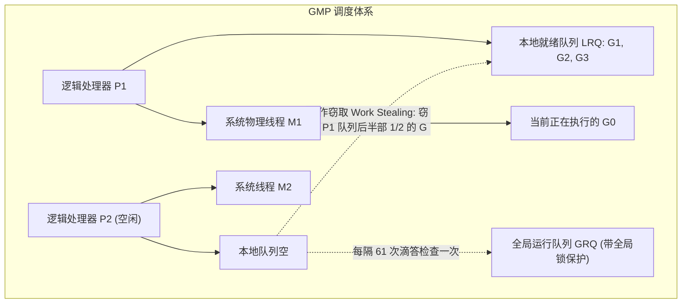

# Go 泛型机制与 GMP 调度器解析

Go 语言凭借极简的语法、原生的并发原语（Goroutine & Channel）以及高效的运行时（Runtime），成为了现代云计算与分布式系统的基石语言。

随着 Go 1.18 引入泛型以及 Go 1.22 正式修复了长达十余年的**循环变量共享作用域 (LoopVar)** 痛点，Go 语言在保持极速编译的同时，工程表现力与运行时调度器效率再次迎来了重要突破。

---

## 一、Go 1.22 核心变革：循环变量独立作用域

在 Go 1.22 之前，`for` / `for range` 循环中的迭代变量在所有循环批次中是共享同一个内存地址的，导致在 Goroutine 中捕获该变量时极易出现“全量输出最终值”的经典 Bug。

```go
// Go 1.22+ 已经完美修复：每次迭代自动生成独立的变量实例
package main

import (
	"fmt"
	"sync"
)

func main() {
	var wg sync.WaitGroup
	values := []string{"Alpha", "Beta", "Gamma"}

	for _, v := range values {
		wg.Add(1)
		// 在 Go 1.22 之前，必须手动显式写 v := v 进行局部遮蔽
		// Go 1.22+ 默认每次循环均为独立生命周期，安全并发！
		go func() {
			defer wg.Done()
			fmt.Println("Processed:", v)
		}()
	}

	wg.Wait()
}
```

---

## 二、泛型底层实现机制：GC Shape Stenciling

Go 语言并没有采用 C++ 的“全量单态化展开”（会导致二进制体积剧烈膨胀和编译极慢），也没有采用 Java 的“全量装箱类型擦除”（会造成大量堆内存分配与性能劣化），而是独创了 **GC Shape (GC 形状)** 混合方案：

| 类型特征 | 处理策略 | 编译与运行时表现 |
| :--- | :--- | :--- |
| **指针 / 接口类型** | 所有指针类型的 GC 内存布局（Shape）完全相同 | **共享同一套机器码**，仅通过传入的 Dictionary 参数查找具体方法表 |
| **基础值类型 (如 int64, float64)** | 内存大小与 CPU 寄存器使用不同 | 针对不同基础数据类型分别单态化编译，保证极限数值计算性能 |

```go
// 现代高性能泛型并发安全 SyncMap 示例
package concurrent

import "sync"

type ConcurrentMap[K comparable, V any] struct {
	mu    sync.RWMutex
	store map[K]V
}

func NewConcurrentMap[K comparable, V any]() *ConcurrentMap[K, V] {
	return &ConcurrentMap[K, V]{
		store: make(map[K]V),
	}
}

func (m *ConcurrentMap[K, V]) Set(key K, val V) {
	m.mu.Lock()
	defer m.mu.Unlock()
	m.store[key] = val
}

func (m *ConcurrentMap[K, V]) Get(key K) (V, bool) {
	m.mu.RLock()
	defer m.mu.RUnlock()
	val, ok := m.store[key]
	return val, ok
}
```

---

## 三、GMP 调度模型与工作窃取 (Work Stealing) 原理

Go 运行时调度器通过 `G` (Goroutine)、`M` (OS Thread)、`P` (Processor 上下文逻辑处理器) 三元组实现极高吞吐的 M:N 用户态并发：



### 调度器核心演进特性：
1. **基于信号的非协作式抢占调度**：通过向运行超时（超过 10ms）的线程发送 `SIGURG` 系统信号，强制中断密集纯计算循环并让出 CPU。
2. **网络轮询器 (NetPoller) 整合**：将阻塞的 Socket IO 转为底层 epoll/kqueue 事件监听，当数据到达时唤醒被挂起的 G，而 M 线程无需经历内核态阻塞。

---

## 四、高并发调优生产守则

1. **避免无节制开辟海量 Goroutine**：单个 G 初始栈仅 2KB，但如果并发千万级仍然会导致内存溢出。在高并发场景中，务必使用 Worker Pool（如 `panjf2000/ants`）做背压限制。
2. **警惕逃逸分析 (Escape Analysis)**：使用 `go build -gcflags="-m"` 检查变量是否发生堆逃逸，尽量利用栈分配减少 GC 暂停压力。
