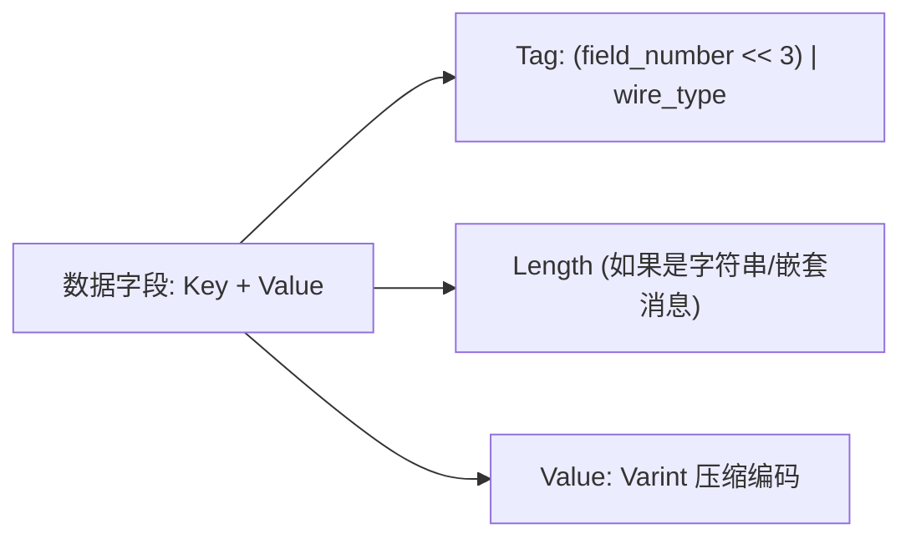

# gRPC 与 Protobuf 高性能微服务通信

在以分布式微服务为核心的后端架构中，服务间 RPC 通信的吞吐量与网络延迟直接决定了整体系统的 SLA。传统的基于 HTTP/1.1 + JSON 的 REST 架构面临着**文本体积臃肿、CPU 反序列化开销大、缺乏强类型契约**以及**连接无法全双工复用**的瓶颈。

Google 主导的 **gRPC** 结合 **Protocol Buffers (Protobuf)** 二进制序列化协议，依托 **HTTP/2 传输层**，已成为现代云原生与微服务架构的通信标准。

---

## 一、Protobuf 极致压缩原理：Varint 与 TLV 编码

Protobuf 能够在体积与解析速度上超越 JSON 5 到 10 倍，关键在于其精妙的二进制底层布局：



### 1. Varint 动态变长整数编码
常规 `int32` 在内存中固定占用 4 字节（32 位）。Varint 每个字节的最高位（MSB, Most Significant Bit）作为延续位（`1` 表示后续字节仍属于该数字，`0` 表示结束），其余 7 位存储有效数值。对于小于 128 的整数，**仅占用 1 个字节**。

### 2. 负数 Zigzag 编码
由于负数补码高位全为 1，直接用 Varint 会固定占用 10 字节。Zigzag 将有符号整数映射为无符号正数：`0 -> 0, -1 -> 1, 1 -> 2, -2 -> 3`，公式为 `(n << 1) ^ (n >> 31)`，大幅压缩负数的网络体积。

---

## 二、gRPC 四种通信模式与 Proto3 定义

```protobuf
// proto/order_service.proto
syntax = "proto3";

package order.v1;
option go_package = "order/v1;orderv1";

service OrderService {
  // 1. 简单一元 RPC (Unary RPC)
  rpc CreateOrder (CreateOrderRequest) returns (OrderResponse);

  // 2. 服务端流式 (Server Streaming)
  rpc SubscribeOrderStatus (OrderStatusRequest) returns (stream OrderStatusUpdate);

  // 3. 客户端流式 (Client Streaming)
  rpc BulkUploadMetrics (stream MetricItem) returns (MetricSummary);

  // 4. 双向流式 (Bidirectional Streaming)
  rpc ChatRoomSession (stream ChatMessage) returns (stream ChatMessage);
}

message CreateOrderRequest {
  string user_id = 1;
  repeated OrderItem items = 2;
  double total_amount = 3;
}

message OrderItem {
  string product_id = 1;
  int32 quantity = 2;
  double price = 3;
}

message OrderResponse {
  string order_id = 1;
  string status = 2;
  int64 created_at = 3;
}

message OrderStatusRequest {
  string order_id = 1;
}

message OrderStatusUpdate {
  string order_id = 1;
  string current_status = 2;
  string message = 3;
}
```

---

## 三、Go 语言生产级 gRPC 服务端与双向拦截器

```go
// server/main.go
package main

import (
	"context"
	"fmt"
	"net"
	"time"

	"google.golang.org/grpc"
	"google.golang.org/grpc/codes"
	"google.golang.org/grpc/status"
	orderv1 "myproject/proto/order/v1"
)

type OrderServerImpl struct {
	orderv1.UnimplementedOrderServiceServer
}

func (s *OrderServerImpl) CreateOrder(ctx context.Context, req *orderv1.CreateOrderRequest) (*orderv1.OrderResponse, error) {
	if req.UserId == "" {
		return nil, status.Errorf(codes.InvalidArgument, "user_id cannot be empty")
	}

	orderId := fmt.Sprintf("ORD-%d", time.Now().UnixNano())
	return &orderv1.OrderResponse{
		OrderId:   orderId,
		Status:    "PENDING_PAYMENT",
		CreatedAt: time.Now().Unix(),
	}, nil
}

// 生产级一元拦截器：统一耗时统计与链路日志
func loggingUnaryInterceptor(
	ctx context.Context,
	req interface{},
	info *grpc.UnaryServerInfo,
	handler grpc.UnaryHandler,
) (interface{}, error) {
	start := time.Now()
	resp, err := handler(ctx, req)
	duration := time.Since(start)

	code := status.Code(err)
	fmt.Printf("[gRPC] Method=%s Duration=%v Code=%s Err=%v\n", info.FullMethod, duration, code, err)
	return resp, err
}

func main() {
	listener, err := net.Listen("tcp", ":50051")
	if err != nil {
		panic(err)
	}

	grpcServer := grpc.NewServer(
		grpc.UnaryInterceptor(loggingUnaryInterceptor),
	)

	orderv1.RegisterOrderServiceServer(grpcServer, &OrderServerImpl{})

	fmt.Println("🚀 gRPC High Performance Service listening on :50051")
	if err := grpcServer.Serve(listener); err != nil {
		panic(err)
	}
}
```

---

## 四、HTTP/2 底层对 gRPC 的赋能与连接治理

1. **HPACK 头部压缩**：微服务间高频调用的公共 Header（如 Token、Trace ID）仅需传输微小索引号。
2. **单一 TCP 连接多路复用**：多个并发 RPC 请求在单个连接上通过交织的 **Stream ID Frame** 独立传输，消除了 TCP 握手开销与队头阻塞。
3. **KeepAlive 探活与死连接规避**：配置 `grpc.KeepaliveParams` 定期发送 HTTP/2 PING 帧，防止 NAT 网关静默丢弃长连接。
