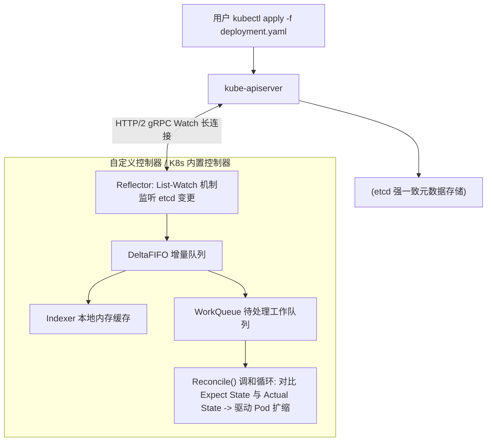
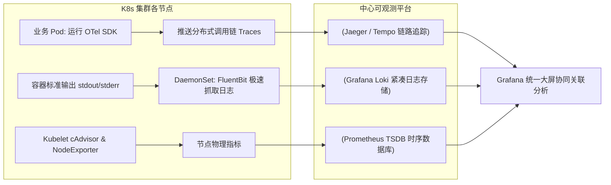

# Kubernetes 容器编排与可观测性全解

在现代云原生架构中，**Kubernetes (K8s)** 已经成为了容器编排与集群调度的事实操作系统标准。它将成千上万台异构物理机/虚拟机抽象为一个统一的计算资源池，并通过声明式 API 实现了海量微服务的自动化扩缩容、滚动更新与故障自愈。

然而，微服务的高度解耦与容器生命周期的极度动态化（秒级创建与销毁），使得系统的排障复杂度呈指数级上升。深入理解 **K8s 控制器驱动原理** 并构建坚固的 **三位一体（Metrics、Logs、Traces）可观测性平台**，是保障集群生产稳定性的关键。

---

## 一、Kubernetes 控制器模式与 Informer 运行机制

Kubernetes 系统的核心精髓是 **声明式设计 (Declarative API)** 与 **调和控制循环 (Reconciliation Loop)**：



1. **List-Watch 机制**：利用 HTTP 长连接实时监听资源版本变化，避免轮询对 `kube-apiserver` 和 `etcd` 造成雪崩压力。
2. **本地内存缓存 (Indexer)**：Informer 在客户端内存中维护集群资源的只读缓存，业务查询无需打到 etcd，极大地提升了并发性能。

---

## 二、生产级健康检查探针与优雅停机 (Graceful Shutdown)

在微服务发布过程中，偶发性 502/504 错误多由 Pod 探针配置不当或未处理停机信号引起：

```yaml
# deployment.yaml 生产级探针与生命周期配置
apiVersion: apps/v1
kind: Deployment
metadata:
  name: order-service
  namespace: production
spec:
  replicas: 3
  template:
    spec:
      terminationGracePeriodSeconds: 60 # 给予容器最长 60 秒处理余下在途请求
      containers:
      - name: app
        image: registry.corp.internal/order-service:v2.4.0
        ports:
        - containerPort: 8080
        
        # 1. 启动探针 (Startup Probe): 保护慢启动应用，在此探针成功前不触发存活检测
        startupProbe:
          httpGet:
            path: /healthz/startup
            port: 8080
          failureThreshold: 30
          periodSeconds: 2 # 最多允许启动 60 秒

        # 2. 就绪探针 (Readiness Probe): 控制流量接入，失败时立即从 K8s Service Endpoints 剔除
        readinessProbe:
          httpGet:
            path: /healthz/ready
            port: 8080
          initialDelaySeconds: 5
          periodSeconds: 5

        # 3. 存活探针 (Liveness Probe): 检测死锁，失败时直接杀掉并重启容器
        livenessProbe:
          httpGet:
            path: /healthz/live
            port: 8080
          initialDelaySeconds: 15
          periodSeconds: 10

        # 4. 【核心优雅下线】：preStop 钩子休眠防丢包
        lifecycle:
          preStop:
            exec:
              command: ["/bin/sh", "-c", "sleep 10"] # 等待 kube-proxy 和 Ingress 路由规则全量同步摘流
```

---

## 三、三位一体云原生可观测性架构落地



---

## 四、生产稳定性 Checklist

1. **严格配置资源配额 (Requests & Limits)**：未配置 `requests` 的 Pod 会被调度器判定为 `BestEffort` 优先级最低，当节点内存紧缺时优先被 OOM Killer 强行处死。
2. **设置 Pod 拓扑分布约束 (TopologySpreadConstraints)**：强制将副本均匀分散至不同可用区（AZ）与不同物理节点，单机房断电亦能保障业务零感知。
