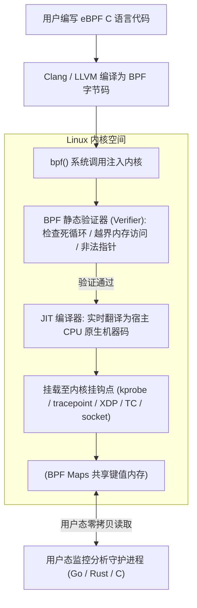

# Linux 内核 eBPF 云原生安全实战

在过去，开发者若想在 Linux 内核层捕获低延迟网络包、监控系统调用（Syscall）或排查内核级性能瓶颈，通常只有两种途径：**修改 Linux 官方内核源码重新编译** 或 **编写内核模块 (Kernel Module)**。然而，内核模块存在致命缺陷 —— 一旦代码中存在空指针解引用或内存越界，会导致整个操作系统 **Kernel Panic 瞬间宕机**。

**eBPF (Extended Berkeley Packet Filter)** 彻底改变了这一现状：它在 Linux 内核内部实现了一个高度安全的**沙箱虚拟机**，允许开发者在无需修改内核源码、无需重启系统的前提下，以**零崩溃风险、微秒级超高性能**动态加载并运行自定义安全与可观测性程序（如 Cilium, Falco, Tetragon）。

---

## 一、eBPF 底层执行架构与安全性验证



### eBPF 验证器 (Verifier) 的三大铁律：
1. **必须证明程序能够在有限步内终止**（禁止无边界的死循环）；
2. **禁止访问未初始化的寄存器或越界访问内核栈空间**；
3. **指令数量与复杂度严格受限**，确保单次事件处理耗时在亚微秒级别，不阻塞宿主线程。

---

## 二、利用 eBPF 监控可疑命令执行实战 (C 代码)

以下是一个使用 `libbpf` 编写的挂载在 `sys_enter_execve` 跟踪点（Tracepoint）的 eBPF 探针，用于实时捕获生产容器内是否有攻击者执行了 `bash` 或 `sh` 反弹 Shell：

```c
// exec_monitor.bpf.c
#include "vmlinux.h"
#include <bpf/bpf_helpers.h>
#include <bpf/bpf_tracing.h>
#include <bpf/bpf_core_read.h>

// 定义通过 BPF RingBuffer 传递给用户态的事件数据结构
struct event_t {
    u32 pid;
    u32 uid;
    char comm[16];
    char filename[256];
};

// 创建高效的无锁环形缓冲区 BPF Map
struct {
    __uint(type, BPF_MAP_TYPE_RINGBUF);
    __uint(max_entries, 256 * 1024); // 256KB
} events SEC(".maps");

// 挂载至 execve 系统调用入口
SEC("tracepoint/syscalls/sys_enter_execve")
int tracepoint__syscalls__sys_enter_execve(struct trace_event_raw_sys_enter_execve *ctx) {
    u64 id = bpf_get_current_pid_tgid();
    u32 pid = id >> 32;
    u32 uid = bpf_get_current_uid_gid();

    // 在 RingBuffer 中预留内存槽位
    struct event_t *event = bpf_ringbuf_reserve(&events, sizeof(*event), 0);
    if (!event) {
        return 0; // 缓冲区满，丢弃以防阻塞内核
    }

    event->pid = pid;
    event->uid = uid;
    bpf_get_current_comm(&event->comm, sizeof(event->comm));

    // 安全从用户空间地址空间读取执行文件名 (防 page fault)
    bpf_probe_read_user_str(&event->filename, sizeof(event->filename), (const char *)ctx->filename_ptr);

    // 提交事件至用户态
    bpf_ringbuf_submit(event, 0);
    return 0;
}

char LICENSE[] SEC("license") = "GPL";
```

---

## 三、XDP (eXpress Data Path) 高性能网络防御

传统网络防火墙（如 iptables / nftables）处理网络包时，必须等网卡驱动分配 `sk_buff` 结构并穿透 Linux 庞大的网络协议栈，开销巨大。

**XDP** 允许 eBPF 程序在 **网卡驱动刚收到 DMA 数据包、尚未分配 `sk_buff` 的极早期（Bare Metal 层）** 直接执行判定：

```c
// xdp_drop_ddos.bpf.c
#include "vmlinux.h"
#include <bpf/bpf_helpers.h>
#include <bpf/bpf_endian.h>

SEC("xdp")
int xdp_firewall(struct xdp_md *ctx) {
    void *data = (void *)(long)ctx->data;
    void *data_end = (void *)(long)ctx->data_end;

    // 边界安全校验 (Verifier 强制要求)
    struct ethhdr *eth = data;
    if ((void *)(eth + 1) > data_end) return XDP_PASS;

    if (eth->h_proto != bpf_htons(ETH_P_IP)) return XDP_PASS;

    struct iphdr *ip = (void *)(eth + 1);
    if ((void *)(ip + 1) > data_end) return XDP_PASS;

    // 针对特定恶意源 IP (例如 192.0.2.1) 在网卡驱动层实现百万 QPS 瞬时直接丢弃！
    if (ip->saddr == bpf_htonl(0xC0000201)) {
        return XDP_DROP; // 0 CPU 拷贝，极速丢包抵抗 100Gbps DDoS 洪峰
    }

    return XDP_PASS;
}
```

---

## 四、eBPF 在云原生领域的杀手级应用

1. **Cilium 替代 kube-proxy**：利用 eBPF 统一接管 Pod 网络流量，绕过 iptables 的 $O(N)$ 线性规则匹配，提升网络吞吐达 40%。
2. **无侵入应用全链路性能分析 (Continuous Profiling)**：无需在代码中埋点，通过 eBPF CPU 采样探针自动生成包含内核与用户态混合栈的实时火焰图。
