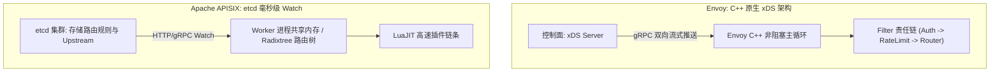

# API 网关选型：Kong、APISIX 与 Envoy

在微服务与云原生架构中，**API 网关 (API Gateway)** 是所有外部南北向流量（North-South Traffic）统一接入的门户喉舌。它承担着反向代理、路由分发、TLS 终结、JWT 鉴权、分布式限流、灰度发布以及全链路可观测性等至关重要的权责。

在开源网关领域，**Kong**、**Apache APISIX** 与 CNCF 毕业项目 **Envoy** 三足鼎立。本文将从底层架构模型、动态配置生效机制、插件生态与吞吐性能四大维度进行深度实测对比。

---

## 一、三大网关底层架构与设计哲学全景

| 评测维度 | Kong (3.x) | Apache APISIX (3.x) | Envoy Proxy (1.30+) |
| :--- | :--- | :--- | :--- |
| **底层核心语言** | OpenResty (Nginx + Lua) | OpenResty (Nginx + LuaJIT) | **现代 C++17 (纯异步事件驱动)** |
| **控制面与配置存储** | PostgreSQL 关系库 / 声明式 YAML (DB-less) | **etcd 分布式协调中心 (毫秒级 Watch 机制)** | **xDS 动态发现协议 (gRPC 流式同步)** |
| **动态路由生效时延** | 秒级 (依赖轮询或 DB 触发，路由变更易发生轻微 worker 抖动) | **亚毫秒级 (毫秒内同步广播至所有 worker)** | **亚毫秒级 (内存级动态更新，零丢包)** |
| **插件扩展能力** | Lua、Go/JS 进程外 PDK、Wasm | **Lua、Java/Python/Go Runner、Wasm** | **C++ 静态编译、WebAssembly (Wasm 插件)** |
| **云原生 Mesh 亲和度** | 中等 (以南北向网关为主) | 高 (支持 K8s Ingress Controller) | **极高 (Istio 服务网格默认标准数据面)** |



---

## 二、动态路由树算法对比：为什么 APISIX 路由匹配极快？

传统网关多采用正则表达式或简单的哈希表匹配，当网关内注册的路由数突破 10,000 条时，匹配时延将呈线性恶化。

- **APISIX** 采用 **基数树 (Radix Tree / Prefix Tree)** 路由匹配算法：无论系统中有 100 条还是 10 万条路由，路由查找的时间复杂度稳定维持在 **$O(K)$**（$K$ 为请求 URL 路径字符串长度），真正实现了路由数量无关的常数级寻址。

---

## 三、性能压测基准实测 (QPS & P99 延迟)

压测配置：32 Core CPU, 64GB 内存, 10Gbps 网络带宽，开启 4 个网关 Worker 进程，后端挂载 0 延迟静态 Mock 节点，执行 1000 并发压测：

```text
# 压测命令 (wrk2 恒定速率压测)
wrk -t16 -c1000 -d60s --latency http://gateway-node:8080/api/v1/orders
```

| 评估指标 | Envoy (1.30) | Apache APISIX (3.8) | Kong (3.6) |
| :--- | :--- | :--- | :--- |
| **基础代理 QPS** | **238,500 req/s** | **224,100 req/s** | 162,000 req/s |
| **开启 JWT+限流插件 QPS** | **184,000 req/s** | **172,500 req/s** | 118,000 req/s |
| **平均延迟 (Avg Latency)** | **0.82 ms** | **0.91 ms** | 1.45 ms |
| **P99 尾部延迟** | **2.1 ms** | **2.4 ms** | 4.8 ms |
| **内存底噪占用** | 65 MB | 48 MB | 180 MB (含 Lua 运行环境) |

---

## 四、生产环境网关选型决策清单

1. **选择 Envoy 的场景**：
   - 全面拥抱 Kubernetes 与服务网格（如 Istio）；
   - 追求极致的 C++ 资源利用效率，统一东西向与南北向流量治理；
   - 团队具备 C++ 或 Wasm 研发能力。
2. **选择 Apache APISIX 的场景**：
   - 需要超高频动态修改路由与热加载配置（毫秒级生效且绝对零抖动）；
   - 偏好使用多语言（Java/Go/Python）编写业务私有网关插件；
   - 需要极高性能且易于与国内开源生态（Nacos, SkyWalking, Sentinel）集成。
3. **选择 Kong 的场景**：
   - 依赖其庞大成熟的企业级插件市场（如 Kong Enterprise 生态）；
   - 现有基础设施已有成熟的 PostgreSQL 运维体系。
