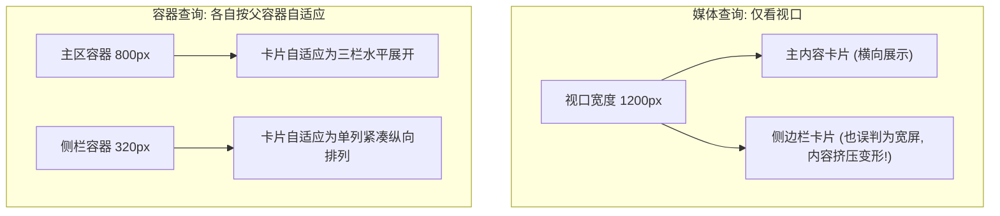

# 现代 CSS 容器查询与自适应组件设计

在长达十余年的响应式 Web 设计中，开发者主要依赖 **媒体查询 (Media Queries, `@media`)** 来调整页面布局。然而，在以 React、Vue 等组件化架构为主流的今天，媒体查询存在一个致命的结构性痛点：**它只能基于整个浏览器视口 (Viewport) 的宽度做出判断，而无法感知父容器给组件分配的实际可用空间**。

当同一个商品卡片组件分别被放置在“宽屏主信息流 (70% 宽)”与“狭窄侧边栏 (30% 宽)”时，媒体查询往往无法正确呈现适配形态。**CSS 容器查询 (Container Queries, `@container`)** 的标准化彻底攻克了这一难题。

---

## 一、媒体查询 vs 容器查询：组件维度的范式颠覆

| 比较维度 | 传统媒体查询 (`@media`) | 现代容器查询 (`@container`) |
| :--- | :--- | :--- |
| **判定基准** | 浏览器全屏视口宽度 (`window.innerWidth`) | 组件所在父级容器的实际渲染宽度 |
| **复用灵活性** | 组件与视口强耦合，嵌入弹窗、侧边栏或网格时易变形 | 组件完全自包含，置于任意尺寸的容器内均能自适应变形 |
| **尺寸单位** | `vw`, `vh`, `vmin`, `vmax` | `cqw` (容器宽度的 1%), `cqh`, `cqi`, `cqb`, `cqmin`, `cqmax` |
| **浏览器支持度** | 全平台支持 (历史悠久) | 现代所有主流浏览器全面原生支持 (Baseline 2023) |



---

## 二、原生容器查询核心语法与实操

要启用容器查询，只需两步：在父容器上声明 `container-type`，并在子组件中通过 `@container` 进行规则响应。

```css
/* 1. 将父容器定义为尺寸查询上下文 */
.card-wrapper {
  container-type: inline-size;
  container-name: card-container;
}

/* 2. 默认紧凑样式 (移动端/侧边栏形态) */
.user-profile-card {
  display: flex;
  flex-direction: column;
  padding: 1rem;
  border-radius: 12px;
  background-color: #1e293b;
  color: #f8fafc;
}

.user-profile-card .avatar {
  width: 64px;
  height: 64px;
  border-radius: 50%;
}

.user-profile-card .bio {
  font-size: 0.875rem;
  margin-top: 0.5rem;
}

/* 3. 当父容器宽度超过 480px 时，自动切换为双栏横向布局 */
@container card-container (min-width: 480px) {
  .user-profile-card {
    flex-direction: row;
    align-items: center;
    gap: 1.5rem;
    padding: 1.5rem;
  }

  .user-profile-card .avatar {
    width: 96px;
    height: 96px;
  }

  .user-profile-card .bio {
    font-size: 1rem;
  }
}

/* 4. 当父容器宽度超过 720px 时，展示完整元数据与操作按钮 */
@container card-container (min-width: 720px) {
  .user-profile-card {
    padding: 2rem;
  }

  .user-profile-card .action-group {
    display: flex;
    margin-left: auto;
    gap: 0.75rem;
  }
}
```

---

## 三、结合 Tailwind CSS 的容器查询企业级落地

Tailwind CSS 原生提供了 `@container` 变体支持（借助 `@tailwindcss/container-queries` 插件或 Tailwind v4 原生特性）：

```tsx
// components/ArticleCard.tsx
export function ArticleCard() {
  return (
    // 声明当前外层为容器
    <div className="@container">
      <div className="flex flex-col @md:flex-row @xl:items-center gap-4 p-4 @md:p-6 bg-slate-900 border border-slate-800 rounded-xl transition-all">
        {/* 封面图：容器狭窄时占满，中等容器固定 180px，超大容器 260px */}
        <div className="w-full @md:w-44 @xl:w-64 aspect-video rounded-lg overflow-hidden shrink-0 bg-slate-800">
          
        </div>

        {/* 文章主体内容 */}
        <div className="flex-1 min-w-0">
          <div className="flex items-center gap-2 text-xs font-semibold text-cyan-400 uppercase tracking-wider">
            <span>技术架构</span>
            <span>•</span>
            <span className="text-slate-400">8 分钟阅读</span>
          </div>

          <h3 className="mt-2 text-base @md:text-lg @xl:text-2xl font-bold text-slate-100 line-clamp-2">
            现代化 CSS 容器查询 (Container Queries) 与自适应组件设计最佳实践
          </h3>

          <p className="mt-2 text-sm text-slate-400 line-clamp-2 @xl:line-clamp-3">
            彻底打破视口断点的约束，使独立卡片组件在弹窗、多列 Grid、侧边栏中均可展现最完美的形态。
          </p>
        </div>
      </div>
    </div>
  );
}
```

---

## 四、核心踩坑点与工程规范

1. **容器死循环陷阱 (Infinite Loops)**：声明为 `container-type: size` 会要求同时监听宽高，如果容器子元素的高度撑大容器，会导致反复重新计算。**在绝大多数业务场景下，请严格使用 `container-type: inline-size`（仅监听行内/水平宽度）**。
2. **文本流式字体缩放巧用 `cqw`**：对于横幅标题，可使用 `font-size: clamp(1.2rem, 4cqw, 3rem)` 代替 `vw`，确保即使组件被放在狭小卡片中，文字也不会溢出视窗。
3. **命名空间隔离**：在嵌套复杂页面时，为关键容器赋予 `container-name`，避免子容器的 `@container` 命中错误的祖先容器。
