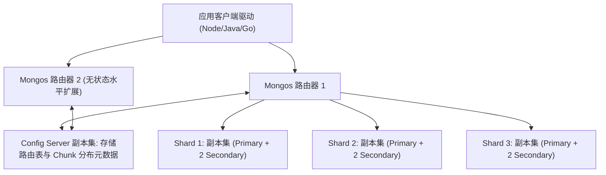

# MongoDB 分片集群与复合索引调优

作为最流行的文档型分布式数据库，**MongoDB** 凭借灵活的 BSON 模式（Schema-Free）、原生的高可用副本集（Replica Set）与强大的横向弹性扩展能力（Sharded Cluster），广泛应用于物联网设备上报、用户动态画像与高吞吐文档存储场景。

然而，在生产环境规模扩展至 TB/PB 级别时，如果分片键选择不当（例如选择单调递增的时间字段导致“写入热点集中在单个 Shard”）或索引不符合 **ESR 法则**，集群性能将出现严重劣化。

---

## 一、MongoDB 分片集群架构全景拓扑

MongoDB 分片集群由三大核心组件协同运作：



| 集群组件 | 核心权责 | 高可用与扩展机制 |
| :--- | :--- | :--- |
| **`mongos`** | 查询路由器。缓存集群路由元数据，负责请求分发与跨分片结果聚合归并 | **完全无状态**，可随意在应用端就近部署多个实例 |
| **`Config Server`** | 存储集群所有数据库、集合、分片键以及 **Chunk（数据块）** 的区间映射元数据 | 必须部署为 **3 节点强一致性副本集** (Raft-like 协议) |
| **`Shard` (分片节点)** | 实际持久化存储数据的节点 | 每个 Shard 均为独立的 **三节点 Replica Set**，保障单分片故障自愈 |

---

## 二、分片键 (Shard Key) 选型深度权衡

分片键决定了数据 Chunk 如何在各个 Shard 之间切分与均衡分布：

| 分片策略 | 切分算法原理 | 核心优势 | 潜在弊端与风险 |
| :--- | :--- | :--- | :--- |
| **范围分片 (Ranged Sharding)** | 按分片键的字典序或数值范围切分相邻区间 | 范围查询 (`$gte`, `$lte`) 极其高效，仅需命中单个或少数 Shard | 若使用自增 ID 或时间戳，**所有新写入全砸向最后一个 Shard，产生写热点** |
| **哈希分片 (Hashed Sharding)** | 对分片键计算 MD5 哈希值，打散到各分片 | **写入流量极其均匀地分散到全部分片**，零写入热点 | 范围查询必须广播至全部分片 (Scatter-Gather) |
| **复合分片 (Compound Sharding)** | 结合多个字段（如 `{ tenant_id: 1, created_at: 1 }`） | 兼顾多租户隔离与租户内时间范围检索 | 索引设计复杂度较高 |

```javascript
// 为海量设备日志集合启用哈希分片，彻底分散写入压力
sh.enableSharding("iot_platform");
sh.shardCollection("iot_platform.device_telemetry", { "device_id": "hashed" });
```

---

## 三、生产级索引优化圣经：ESR 复合索引设计法则

在为复杂查询创建复合索引时，字段顺序必须严格遵循 **ESR (Equality, Sort, Range)** 黄金法则：


### 违反 ESR 与遵循 ESR 的性能对比实测：

```javascript
// 业务查询需求：查找北京地区、年龄大于 20 岁、按注册时间倒序排列的用户
db.users.find({ city: "Beijing", age: { $gte: 20 } }).sort({ registered_at: -1 });

// ❌ 错误索引 (将范围放在排序前): { city: 1, age: 1, registered_at: 1 }
// 数据库引擎执行计划：虽然命中索引，但扫描完 age 后必须在内存中执行昂贵的 SORT 排序操作 (InMemorySort)!

// ✅ 遵循 ESR 黄金法则的正确索引: { city: 1, registered_at: -1, age: 1 }
// 数据库引擎执行计划：完全消除内存排序，直接利用 B-Tree 索引有序性流式返回，扫描行数 = 返回行数！
db.users.createIndex({ city: 1, registered_at: -1, age: 1 });
```

---

## 四、高可用写入一致性配置 (Write Concern)

在金融和核心交易场景中，必须在客户端连接串中显式声明 **`w: "majority"`** 写入关注级别：

```javascript
// 保证数据至少同步写入到副本集多数派节点并落入日志 (Journal) 后才向客户端返回成功
const client = new MongoClient("mongodb://mongos1:27017,mongos2:27017/app", {
  writeConcern: {
    w: "majority",
    j: true, // 强制要求刷盘日志落盘
    wtimeoutMS: 5000, // 防止网络分区时无限挂起
  },
  readPreference: "secondaryPreferred", // 读写分离：优先读取从节点降低主库压力
});
```
