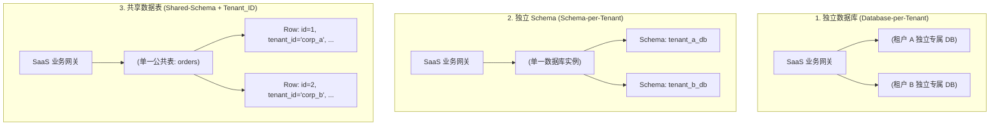

# SaaS 多租户架构与数据隔离实战

在面向企业级客户的 **B 端 SaaS (Software as a Service)** 系统中，**多租户 (Multi-Tenancy)** 是最核心的顶层架构模式。所谓多租户，是指一套共享的软硬件基础设施同时为多个相互独立的企业客户（租户 Tenant）提供服务。

多租户架构设计中最严峻的技术挑战在于：**如何在保证极致的硬件资源利用率（成本控制）的同时，实现银行级严格的数据安全隔离，杜绝任何形式的跨租户数据越权泄漏 (Data Leaks)**。

---

## 一、三大数据隔离方案横向全方位权衡



| 方案模式 | 数据物理隔离度 | 硬件与维护成本 | 数据库连接池开销 | 租户扩容能力 | 适用业务场景 |
| :--- | :--- | :--- | :--- | :--- | :--- |
| **独立数据库** | **最高 (物理隔离)** | 极高（需为每个租户管理独立 DB 实例与迁移） | 极高（连接数随租户数线性爆炸） | 租户间扩缩容完全互不影响 | 大客户定制 VIP 专享版、银行政企合规场景 |
| **独立 Schema** | 高（逻辑命名空间隔离） | 中等（表结构升级需循环遍历数千个 Schema） | 较高（各 Schema 共享同一 DB 资源） | 中等 | 中大型中端企业客户 |
| **共享数据表** | 依赖应用层/引擎过滤 | **最低（单表承载所有租户，极致成本控制）** | **最低（统一数据库连接池）** | **极高（支持千万级微小型租户）** | **通用海量标准版 SaaS、免审美中小企业应用** |

---

## 二、基于 PostgreSQL RLS (行级安全) 的坚实防御

在“共享数据表”模式中，传统方案依赖应用层在每个 SQL 查询中手动拼写 `WHERE tenant_id = 'xxx'`。这种方式存在致命的人为疏忽风险（一旦某个新员工写漏了 `WHERE` 条件，便会导致全量租户数据瞬间裸奔）。

**PostgreSQL 的 Row-Level Security (RLS)** 将租户过滤策略直接下沉到**数据库内核引擎层面**：

### 1. 数据库层启用 RLS 策略

```sql
-- 1. 创建订单业务表并强制要求 tenant_id 字段
CREATE TABLE tenant_orders (
    id UUID PRIMARY KEY DEFAULT gen_random_uuid(),
    tenant_id VARCHAR(64) NOT NULL,
    order_no VARCHAR(32) NOT NULL,
    amount NUMERIC(12, 2) NOT NULL,
    created_at TIMESTAMP WITH TIME ZONE DEFAULT NOW()
);

CREATE INDEX idx_orders_tenant ON tenant_orders(tenant_id);

-- 2. 启用表的行级安全策略
ALTER TABLE tenant_orders ENABLE ROW LEVEL SECURITY;

-- 3. 创建强制租户隔离策略：仅允许读取和操作当前会话变量 app.current_tenant_id 匹配的数据
CREATE POLICY tenant_isolation_policy ON tenant_orders
    AS RESTRICTIVE
    FOR ALL
    USING (tenant_id = current_setting('app.current_tenant_id', true))
    WITH CHECK (tenant_id = current_setting('app.current_tenant_id', true));
```

---

## 三、Node.js / Go 应用层动态租户上下文注入

应用服务在从 HTTP 鉴权请求中解析出租户身份后，在获取数据库连接的事务中执行 `SET LOCAL` 配置，使策略即刻生效：

```typescript
// middleware/tenant-context.ts
import { Request, Response, NextFunction } from 'express';
import { PoolClient } from 'pg';
import { dbPool } from '@/lib/db';

export async function withTenantContext<T>(
  tenantId: string,
  operation: (client: PoolClient) => Promise<T>
): Promise<T> {
  const client = await dbPool.connect();
  try {
    // 开启本地事务，并在当前连接会话中注入租户上下文
    await client.query('BEGIN');
    
    // SET LOCAL 仅对当前事务生效，事务提交/回滚后自动复位，绝不污染连接池！
    await client.query("SELECT set_config('app.current_tenant_id', $1, true)", [tenantId]);

    const result = await operation(client);

    await client.query('COMMIT');
    return result;
  } catch (error) {
    await client.query('ROLLBACK');
    throw error;
  } finally {
    client.release();
  }
}
```

### 业务层查询体验：零心智负担

```typescript
// 业务代码执行查询时，即便不写 WHERE tenant_id，PostgreSQL 内核也会自动强制过滤！
const orders = await withTenantContext(req.user.tenantId, async (client) => {
  const res = await client.query('SELECT * FROM tenant_orders WHERE amount > 100');
  return res.rows; // 绝对只返回属于当前 tenantId 的记录！
});
```

---

## 四、生产治理 Checklist

1. **混合多租户模式 (Hybrid Tenancy)**：将高付费大型企业分配至“独立数据库集群”，海量免费/小微企业聚合在“共享数据表集群”，兼顾安全性与边际利润。
2. **异步队列与定时任务租户感知**：发送到 RabbitMQ / Kafka 的所有业务消息体中，必须严格包含 `tenant_id` Header，消费端处理时务必先装载该租户上下文。
