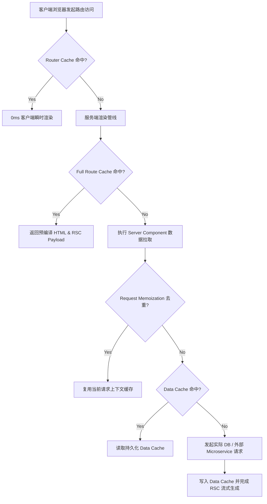

# Next.js App Router 性能调优与 ISR

在 Next.js 从 Pages Router 演进到 App Router 后，其底层的渲染与缓存体系经历了翻天覆地的重构。许多团队在将大型生产项目迁移至 App Router 后，常因不理解其多级缓存模型而遭遇“数据更新不及时”、“缓存命中率低下”或“内存泄漏与构建超时”等难题。

本文将以电商与高频内容发布场景为蓝本，深入剖析 Next.js App Router 的**四层缓存机制**与**按需增量静态再生 (On-demand ISR)** 的工业级实现。

---

## 一、App Router 深度透视：四层缓存架构模型

Next.js 在服务端与客户端之间设计了严密的缓存链条，每一层具有不同的生命周期与失效策略：

| 缓存层级 | 存储位置 | 缓存内容 | 生命周期与触发时机 | 失效 / 再验证方式 |
| :--- | :--- | :--- | :--- | :--- |
| **Request Memoization** | 服务端内存 | 同一请求周期内相同的 `fetch(url)` 结果 | 单次请求/渲染结束即销毁 | 仅在单次 HTTP 请求内去重 |
| **Data Cache** | 服务端持久存储 | 跨请求、跨部署的 API 数据响应 | 跨请求持久化存储 | `revalidateTag()` / `revalidatePath()` |
| **Full Route Cache** | 服务端静态产物 | 预渲染的 HTML 与 RSC Payload | 长期持久化，构建时生成 | 数据缓存失效后自动按需重新构建 |
| **Router Cache** | 浏览器内存 | 已访问页面的 RSC Payload 与静态片段 | 会话级别（动态页面 30s，静态页面 5min） | `router.refresh()` 或客户端路由变异 |



---

## 二、按需 ISR 核心策略与生产实战

传统的定时轮询 ISR (`revalidate: 60`) 在千万级内容场景下存在明显的弊端：低频访问页面白白浪费计算资源，高频页面又有 60 秒的数据不一致窗口。

**基于 Tag 的按需再验证 (On-demand Tag Revalidation)** 是最优解法：

### 1. 为数据请求打上精细粒度的 Cache Tags

```typescript
// services/post.ts
export interface PostDetail {
  id: string;
  slug: string;
  title: string;
  content: string;
  categoryId: string;
  updatedAt: string;
}

export async function getPostBySlug(slug: string): Promise<PostDetail> {
  const res = await fetch(`https://api.internal.org/posts/${slug}`, {
    // 开启 Next.js 增强缓存，并绑定业务标签
    next: {
      tags: [`post-${slug}`, 'posts-list'],
      revalidate: 86400, // 兜底 24 小时自然失效
    },
    headers: {
      'Authorization': `Bearer ${process.env.INTERNAL_API_KEY}`,
    },
  });

  if (!res.ok) {
    throw new Error(`Failed to fetch post: ${res.statusText}`);
  }

  return res.json();
}
```

### 2. 构建安全的 Webhook 刷新端点

在后台 CMS 或数据发布系统中，当文章发生修改、下架或评论发布时，向 Next.js 发起精准 Webhook 触发即时失效：

```typescript
// app/api/revalidate/route.ts
import { NextRequest, NextResponse } from 'next/server';
import { revalidateTag, revalidatePath } from 'next/cache';

export async function POST(request: NextRequest) {
  const secret = request.headers.get('x-revalidate-secret');
  if (secret !== process.env.REVALIDATION_SECRET_TOKEN) {
    return NextResponse.json({ message: 'Invalid secret token' }, { status: 401 });
  }

  const { tag, path } = await request.json();

  if (tag) {
    // 毫秒级失效所有关联该 Tag 的服务端页面与数据缓存
    revalidateTag(tag);
    return NextResponse.json({ revalidated: true, type: 'tag', target: tag, now: Date.now() });
  }

  if (path) {
    revalidatePath(path, 'page');
    return NextResponse.json({ revalidated: true, type: 'path', target: path, now: Date.now() });
  }

  return NextResponse.json({ message: 'Missing tag or path parameter' }, { status: 400 });
}
```

---

## 三、动态与静态路由的性能极致优化手段

### 1. `generateStaticParams` 批量构建预取

对于头部热点文章，在 `build` 阶段预先生成静态页面，长尾冷数据则在首次访问时静默 ISR 生成：

```typescript
// app/posts/[slug]/page.tsx
import { getTopPostsSlugs, getPostBySlug } from '@/services/post';
import { notFound } from 'next/navigation';

// 仅构建期预渲染前 500 篇热门文章，控制 CI 构建时间在 3 分钟以内
export async function generateStaticParams() {
  const topSlugs = await getTopPostsSlugs({ limit: 500 });
  return topSlugs.map((item) => ({
    slug: item.slug,
  }));
}

// 允许访问未在构建期预生成的长尾页面，并在首次访问时走服务端增量构建
export const dynamicParams = true;

export default async function PostPage({ params }: { params: Promise<{ slug: string }> }) {
  const { slug } = await params;
  const post = await getPostBySlug(slug);

  if (!post) {
    notFound();
  }

  return (
    <article className="prose prose-slate max-w-4xl mx-auto py-12">
      <h1 className="text-4xl font-bold tracking-tight">{post.title}</h1>
      <div className="mt-6 leading-relaxed" dangerouslySetInnerHTML={{ __html: post.content }} />
    </article>
  );
}
```

---

## 四、生产环境调优建议

1. **统一禁用无状态的默认 `no-store`**：除非涉及强用户私密态，否则尽量采用 `next: { revalidate: X, tags: [...] }` 替代无缓存策略，大幅减轻后端微服务与数据库的 QPS 压力。
2. **正确利用 Suspense 实现骨架流式推送**：将高延迟数据依赖下沉到具体的叶子组件中，利用 HTTP 块传输编码 (Chunked Transfer) 秒开页面主体。
3. **监控 Cache-Control 与 TTFB**：在 Edge/CDN 层面配置 `stale-while-revalidate`，确保全球用户在全球任意节点均能享受到 50ms 以内的极速响应。
