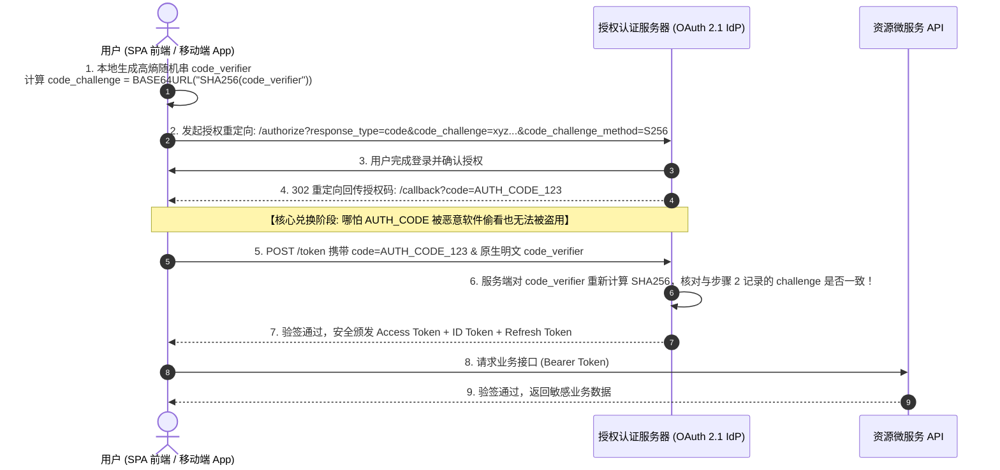

# OAuth 2.1 与 PKCE 安全认证实战

在现代分布式系统、移动端应用与单页 Web 应用（SPA）中，如何安全地向第三方系统或前端单页应用授予受限的资源访问权限，是身份安全架构的核心命题。

传统的 **OAuth 2.0 (RFC 6749)** 规范由于历史包袱，包含了许多在当今移动操作系统与无信任客户端（Public Clients）环境下存在严重安全漏洞的旧模式（如隐式授权 Implicit Grant 与资源所有者密码凭据模式）。

**OAuth 2.1** 整合并收紧了安全基线，**正式强制全场景推行基于 PKCE 的授权码模式**。结合 **OIDC (OpenID Connect)** 身份层，构成了现代统一鉴权与身份体系的黄金标准。

---

## 一、OAuth 2.1 核心变革：为什么要彻底废弃旧模式？

| 授权模式 | OAuth 2.0 历史定义 | OAuth 2.1 规范裁决 | 废弃 / 收紧的核心安全根因 |
| :--- | :--- | :--- | :--- |
| **隐式授权 (Implicit Grant)** | 授权服务器直接在浏览器 URL Hash 中返回 Access Token | ❌ **彻底废弃 (Removed)** | Token 暴露在浏览器访问历史、Referer 标头与系统日志中，极易被 XSS/中间人直接窃取 |
| **密码模式 (Resource Owner Password)** | 客户端直接向用户索要真实明文账号密码 | ❌ **彻底废弃 (Removed)** | 严重破坏“不泄露凭据给第三方客户端”的核心原则，增加了客户端被钓鱼攻破的风险 |
| **基础授权码模式 (Standard Auth Code)** | 通过重定向获取 Auth Code，再换取 Token | ⚠️ **全面升级，强制 PKCE** | 在移动端/单页应用中，恶意 App 可劫持自定义 URI Scheme 拦截 Auth Code |
| **PKCE 授权码模式 (Auth Code with PKCE)** | 引入动态随机密钥验证码与 SHA-256 哈希 | **✅ 官方唯一强制推荐标准！** | 即使攻击者拦截到 Auth Code，因没有随机 `code_verifier`，**依然无法换取 Token！** |

---

## 二、PKCE (Proof Key for Code Exchange) 运作时序图

PKCE 通过客户端在本地生成高熵随机字符串（`code_verifier`），并计算其 SHA-256 哈希作为 `code_challenge` 传给服务端：



---

## 三、生产级 PKCE 客户端生成与调用实战

```typescript
// auth/pkce-helper.ts

// 1. 生成高熵随机字符串 code_verifier
export function generateCodeVerifier(length = 64): string {
  const charset = 'ABCDEFGHIJKLMNOPQRSTUVWXYZabcdefghijklmnopqrstuvwxyz0123456789-._~';
  const array = new Uint8Array(length);
  crypto.getRandomValues(array);
  return Array.from(array, (byte) => charset[byte % charset.length]).join('');
}

// 2. 计算 SHA-256 摘要并转换为 Base64URL 编码生成 code_challenge
export async function generateCodeChallenge(verifier: string): Promise<string> {
  const encoder = new TextEncoder();
  const data = encoder.encode(verifier);
  const digest = await crypto.subtle.digest('SHA-256', data);

  // 转换为 Base64URL
  return btoa(String.fromCharCode(...new Uint8Array(digest)))
    .replace(/\+/g, '-')
    .replace(/\//g, '_')
    .replace(/=+$/, '');
}

// 3. 发起合规的 OAuth 2.1 登录流程
export async function redirectToLogin() {
  const verifier = generateCodeVerifier();
  const challenge = await generateCodeChallenge(verifier);

  // 将 verifier 安全存入当前会话的 sessionStorage (仅单次临时使用)
  sessionStorage.setItem('pkce_verifier', verifier);

  const authUrl = new URL('https://auth.enterprise.org/oauth/authorize');
  authUrl.searchParams.set('client_id', 'my_spa_client_id');
  authUrl.searchParams.set('response_type', 'code');
  authUrl.searchParams.set('redirect_uri', 'https://app.enterprise.org/auth/callback');
  authUrl.searchParams.set('scope', 'openid profile email');
  authUrl.searchParams.set('code_challenge', challenge);
  authUrl.searchParams.set('code_challenge_method', 'S256');

  window.location.href = authUrl.toString();
}
```

---

## 四、刷新令牌轮换 (Refresh Token Rotation)

为了防止长期有效的 Refresh Token 被盗用，OAuth 2.1 强烈推荐启用 **Token Rotation (单次刷新即焚)**：
1. 客户端每次向 `/token` 发起刷新请求时，授权服务器不仅颁发新的 Access Token，**同时吊销旧的 Refresh Token 并颁发全新的 Refresh Token**；
2. **防盗用检测 (Breach Detection)**：如果一个已被废弃的旧 Refresh Token 再次被提交，授权服务器立即识别为**凭据被黑客窃取**，即刻**吊销该用户所有已下发的全部 Token 会话**，强行踢下线！
