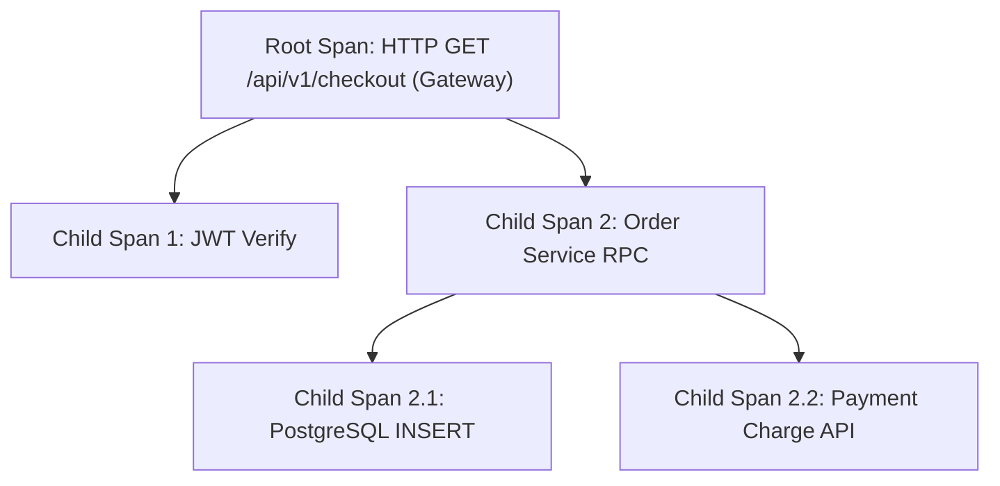

# OpenTelemetry 与 Jaeger 链路追踪实战

在复杂的分布式微服务体系中，单个用户发起的 HTTP 请求往往需要穿透十几个跨语言、跨主机的微服务（API 网关 -> 用户中心 -> 订单服务 -> 支付中心 -> 数据库/Redis/第三方接口）。

一旦某个请求发生偶发性慢查询（如耗时 3 秒）或 500 错误，传统的单机离散日志如同大海捞针。**分布式链路追踪 (Distributed Tracing)** 通过为每个请求赋予全局唯一的 **Trace ID**，并将全链路的调用拓扑以有向无环图（DAG）形式可视化呈现。**OpenTelemetry (OTel)** 已经成为 CNCF 定义的云原生统一遥测标准。

---

## 一、W3C Trace Context 标准与 Span 上下文模型

```text
HTTP Request Header:
traceparent: 00-4bf92f3577b34da6a3ce929d0e0e4736-00f067aa0ba902b7-01
             -- -------------------------------- ---------------- --
             版本            Trace ID (16字节)        Parent Span ID    Flags (01=已采样)
```



- **Trace (全局调用链)**：代表单次端到端请求在整个分布式系统中的完整旅程。
- **Span (跨度单元)**：链路中的单个工作单元，记录操作名称、开始/结束时间戳、属性（Attributes 如 `http.status_code`）、事件（Events）与状态。

---

## 二、Node.js / TypeScript 自动插桩与显式追踪实战

借助 OpenTelemetry Node SDK，可以无侵入自动拦截 HTTP、Express、PgSQL 与 Redis 客户端调用：

```typescript
// tracing.ts (在应用程序最顶部优先导入启动)
import { NodeSDK } from '@opentelemetry/sdk-node';
import { getNodeAutoInstrumentations } from '@opentelemetry/auto-instrumentations-node';
import { OTLPTraceExporter } from '@opentelemetry/exporter-trace-otlp-grpc';
import { Resource } from '@opentelemetry/resources';
import { ATTR_SERVICE_NAME, ATTR_SERVICE_VERSION } from '@opentelemetry/semantic-conventions';

const traceExporter = new OTLPTraceExporter({
  // 将链路追踪数据通过 gRPC 发送至本地 OTel Collector 或 Jaeger OTLP 端口
  url: 'http://jaeger-collector:4317',
});

const sdk = new NodeSDK({
  resource: new Resource({
    [ATTR_SERVICE_NAME]: 'order-service',
    [ATTR_SERVICE_VERSION]: '1.2.0',
    'deployment.environment': 'production',
  }),
  traceExporter,
  instrumentations: [
    getNodeAutoInstrumentations({
      '@opentelemetry/instrumentation-fs': { enabled: false }, // 关闭高频无意义的本地文件 IO 追踪
    }),
  ],
});

sdk.start();
console.log('🔭 OpenTelemetry Tracing initialized successfully');

process.on('SIGTERM', () => {
  sdk.shutdown().finally(() => process.exit(0));
});
```

### 业务代码中显式创建自定义子 Span：

```typescript
import { trace, SpanStatusCode } from '@opentelemetry/api';

const tracer = trace.getTracer('order-service-custom');

export async function processOrderPayment(orderId: string, amount: number) {
  // 显式开启自定义 Span，自动继承当前上下文的 Parent Span
  return tracer.startActiveSpan('processOrderPayment', async (span) => {
    span.setAttribute('business.order_id', orderId);
    span.setAttribute('business.amount', amount);

    try {
      // 模拟核心计算
      if (amount > 100000) {
        span.addEvent('触发大额支付人工风控审核');
      }
      const result = await externalPaymentGateway(orderId, amount);
      span.setStatus({ code: SpanStatusCode.OK });
      return result;
    } catch (error: any) {
      // 记录异常至 Span
      span.recordException(error);
      span.setStatus({
        code: SpanStatusCode.ERROR,
        message: error.message,
      });
      throw error;
    } finally {
      span.end(); // 必须显式结束 Span
    }
  });
}
```

---

## 三、采样率治理：头部采样 vs 尾部采样

在海量 QPS（如 100,000 req/s）系统中，如果 100% 全量收集所有 Span，网络带宽与 Jaeger 存储集群将不堪重负：

| 采样机制 | 工作原理 | 优点 | 缺点 |
| :--- | :--- | :--- | :--- |
| **Head-based Sampling (头部采样)** | 请求到达网关第一跳时，根据固定比例（如 5%）决定是否采样 | **极低 CPU 开销**，SDK 端即刻丢弃未采样 Span | 可能会漏掉关键的偶发性 500 异常与长尾慢请求 |
| **Tail-based Sampling (尾部采样)** | 由 **OTel Collector** 在内存中暂存完整 Trace，根据最终结果（如耗时 > 1s 或状态为 ERROR）决定是否保留 | **100% 捕获所有故障与慢查询** | OTel Collector 需占用较多缓冲内存 |

```yaml
# otel-collector-config.yaml 尾部采样配置
processors:
  tail_sampling:
    decision_wait: 5s
    num_traces: 50000
    expected_new_traces_per_sec: 2000
    policies:
      # 策略 1: 发生错误的请求 100% 记录
      - name: error-policy
        type: status_code
        status_code: { status_codes: [ ERROR ] }
      # 策略 2: 耗时超过 1000ms 的慢请求 100% 记录
      - name: latency-policy
        type: latency
        latency: { threshold_ms: 1000 }
      # 策略 3: 其余常规请求按 1% 随机抽样
      - name: probabilistic-policy
        type: probabilistic
        probabilistic: { sampling_percentage: 1.0 }
```
