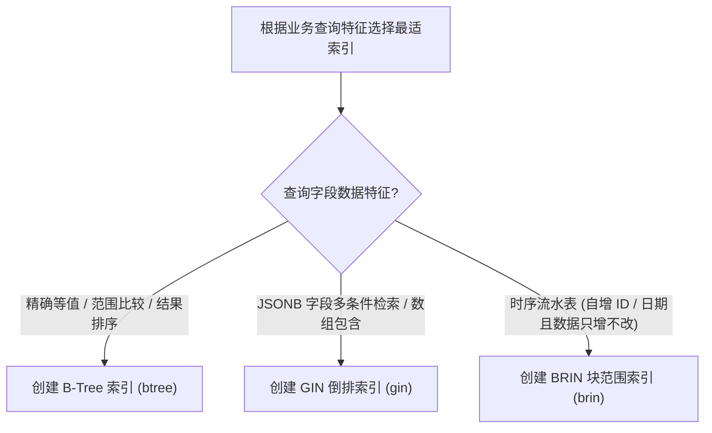

# PostgreSQL 索引调优与高并发死锁排查

**PostgreSQL (PG)** 作为功能极其强大的开源对象关系型数据库，在支持复杂查询、JSONB 半结构化数据以及高并发事务处理上广受赞誉。

然而，在生产环境千万级数据与突发并发流量冲击下，开发团队常面临两大痛点：
1. **索引选型盲目**：无论何种字段均使用默认的 B-Tree 索引，导致索引体积反超数据表本身、写性能严重衰退；
2. **偶发性死锁 (Deadlock)**：多个并发事务以不一致的顺序更新行锁，导致数据库连接池被耗尽、应用报 `ERROR: deadlock detected` 错误。

---

## 一、PostgreSQL 三大主力索引物理特性与选型矩阵

| 索引类型 | 物理底层数据结构 | 优势操作符 / 适用场景 | 索引存储体积与维护开销 |
| :--- | :--- | :--- | :--- |
| **B-Tree** | 自平衡多路搜索树 | `=`, `<`, `<=`, `>`, `>=`, `BETWEEN`, `IN`, 排序 `ORDER BY` | 较大（随着写操作发生页面分裂） |
| **GIN (Generalized Inverted Index)** | 倒排索引（键指向包含该键的元组 TID 列表） | `@>`, `?`, `?|`, `?&` (JSONB 包含检索、数组交集、全文检索) | 较大，写入时开销高（需合并倒排列表） |
| **BRIN (Block Range Index)** | 块范围索引（仅记录每 128 个数据页的 Min/Max 范围） | 物理按时间或自增 ID 自然单调递增排列的**海量时序 / 归档大表** | **极小（通常仅为 B-Tree 的 1/100 到 1/1000 ！）** |



---

## 二、`EXPLAIN (ANALYZE, BUFFERS)` 深度性能分析

在优化慢查询时，严禁只看 `EXPLAIN` 的静态估算成本，必须使用 `EXPLAIN (ANALYZE, BUFFERS)` 查看真实的物理磁盘缓存命中：

```sql
EXPLAIN (ANALYZE, BUFFERS, TIMING)
SELECT id, payload->>'status' AS status
FROM event_logs
WHERE payload @> '{"status": "FAILED", "region": "ap-east"}'
ORDER BY created_at DESC
LIMIT 50;
```

### 关键执行计划输出解读：

```text
Limit  (cost=12.40..85.20 rows=50 width=48) (actual time=0.450..1.210 rows=50 loops=1)
  Buffers: shared hit=182 read=0  <--- 核心指标: shared hit 表示完全命中内存缓冲，0 磁盘物理 IO
  ->  Bitmap Heap Scan on event_logs  (cost=12.40..540.10 rows=400) (actual time=0.448..1.190 rows=50)
        Recheck Cond: (payload @> '{"status": "FAILED", "region": "ap-east"}'::jsonb)
        Buffers: shared hit=182
        ->  Bitmap Index Scan on idx_event_logs_gin  (cost=0.00..12.30 rows=400) (actual time=0.120..0.120)
              Index Cond: (payload @> '{"status": "FAILED", "region": "ap-east"}'::jsonb)
              Buffers: shared hit=8
Planning Time: 0.150 ms
Execution Time: 1.280 ms  <--- 实际真实耗时仅 1.28 毫秒
```

---

## 三、高并发行级死锁 (Deadlock) 产生根因与实战排查

### 1. 死锁产生的典型场景（加锁顺序不一致）

- **事务 1 (T1)**：先 `UPDATE accounts SET balance = balance - 100 WHERE id = 10;`，再试图更新 `id = 20` 的行；
- **事务 2 (T2)**：先 `UPDATE accounts SET balance = balance + 100 WHERE id = 20;`，再试图更新 `id = 10` 的行；
- 两个事务互相等待对方释放排他锁（X 锁），产生死锁循环等待。

### 2. 实时定位死锁阻塞链路 SQL

```sql
-- 查询当前正在等待行锁的阻塞与被阻塞事务信息
SELECT
    blocked_locks.pid     AS blocked_pid,
    blocked_activity.usename  AS blocked_user,
    blocking_locks.pid    AS blocking_pid,
    blocking_activity.usename AS blocking_user,
    blocked_activity.query    AS blocked_statement,
    blocking_activity.query   AS current_statement_in_blocking_process
FROM pg_catalog.pg_locks blocked_locks
JOIN pg_catalog.pg_stat_activity blocked_activity ON blocked_activity.pid = blocked_locks.pid
JOIN pg_catalog.pg_locks blocking_locks 
    ON blocking_locks.locktype = blocked_locks.locktype
    AND blocking_locks.database IS NOT DISTINCT FROM blocked_locks.database
    AND blocking_locks.relation IS NOT DISTINCT FROM blocked_locks.relation
    AND blocking_locks.page IS NOT DISTINCT FROM blocked_locks.page
    AND blocking_locks.tuple IS NOT DISTINCT FROM blocked_locks.tuple
    AND blocking_locks.virtualxid IS NOT DISTINCT FROM blocked_locks.virtualxid
    AND blocking_locks.transactionid IS NOT DISTINCT FROM blocked_locks.transactionid
    AND blocking_locks.classid IS NOT DISTINCT FROM blocked_locks.classid
    AND blocking_locks.objid IS NOT DISTINCT FROM blocked_locks.objid
    AND blocking_locks.objsubid IS NOT DISTINCT FROM blocked_locks.objsubid
    AND blocking_locks.pid != blocked_locks.pid
JOIN pg_catalog.pg_stat_activity blocking_activity ON blocking_activity.pid = blocking_locks.pid
WHERE NOT blocked_locks.granted;
```

---

## 四、生产死锁根治四大法则

1. **严格按全局主键升序加锁**：
   在执行跨多行的批量更新或扣减操作时，应用层必须对涉及的主键数组进行严格排序（如 `WHERE id IN (10, 20) ORDER BY id ASC`），确保所有并发事务均按照完全相同的物理顺序申请行锁。
2. **利用 `SELECT ... FOR UPDATE SKIP LOCKED`**：
   在实现高并发任务队列分发时，使用 `SKIP LOCKED` 允许 Worker 自动跳过已被其他并发事务锁定的行，实现零阻塞的高性能消费。
3. **设置合理的 `statement_timeout` 与 `deadlock_timeout`**：
   将 `deadlock_timeout` 设置为 1000ms，在死锁发生后尽早触发检测并主动中断代价较小的事务，保障数据库主线程不被耗尽。
