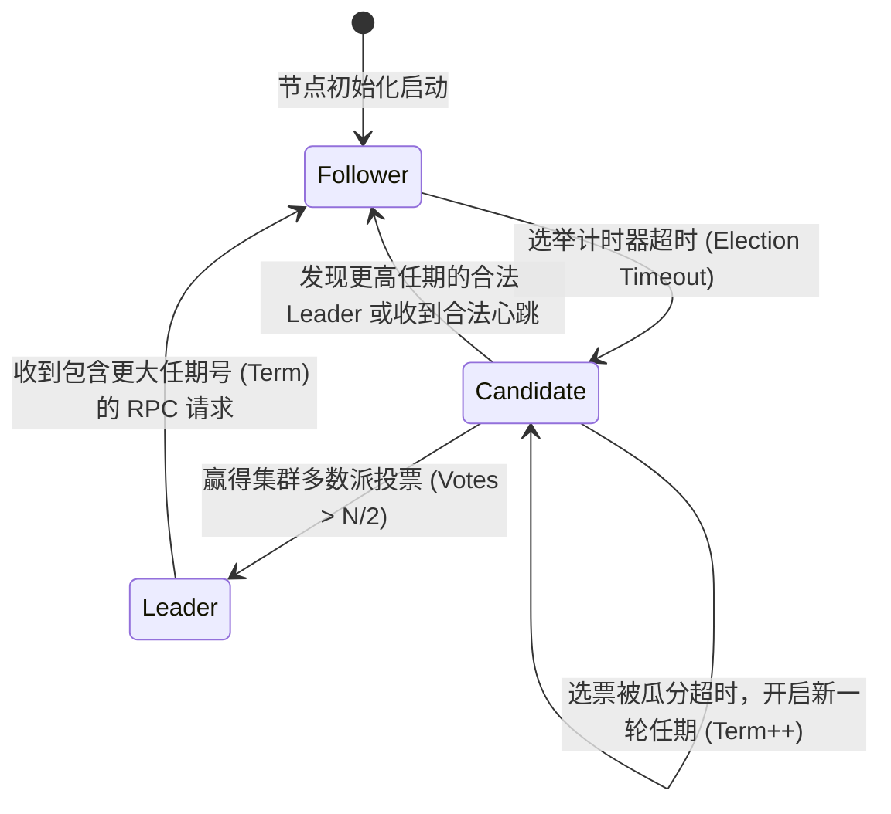

# Raft 共识算法与分布式 KV 存储实现

在分布式系统领域，如何让集群中分布在不同机架、甚至跨机房的多个节点就某个状态或操作达成完全一致，是所有高可用数据库（如 TiDB / TiKV、etcd、Consul）的基石问题。

相比以艰深晦涩著称的 Paxos 协议，**Raft 共识算法** 通过将一致性问题明确划分为 **Leader 选举 (Leader Election)**、**日志复制 (Log Replication)** 与 **安全性约束 (Safety)**，极大地提升了算法的可理解性与工程落地确定性。

---

## 一、Raft 节点三大角色与状态机运转

集群中任意时刻，每个节点只能处于以下三种状态之一：



| 角色类型 | 核心职责 |
| :--- | :--- |
| **Leader (领导者)** | 唯一接收客户端读写请求，全权负责将日志条目并行复制给所有 Follower，并向 Follower 发送周期性心跳。 |
| **Follower (跟随者)** | 完全被动响应来自 Leader 和 Candidate 的 RPC 请求；若在随机超时时间内未收到心跳，则自动转为 Candidate 发起竞选。 |
| **Candidate (候选人)** | 增加当前任期号 (Term)，为自己投票并向全集群广播 `RequestVote` RPC 请求拉票。 |

---

## 二、Raft 核心 RPC 结构与 Go 语言实现

### 1. 核心状态数据结构

```go
// raft/raft.go
package raft

import (
	"sync"
	"time"
)

type NodeRole int

const (
	RoleFollower NodeRole = iota
	RoleCandidate
	RoleLeader
)

type LogEntry struct {
	Term    int         // 该日志条目生成时的任期号
	Index   int         // 全局单调递增的日志索引
	Command interface{} // 业务状态机指令 (例如 SET key value)
}

type RaftNode struct {
	mu        sync.Mutex
	peers     []string // 集群中所有对端节点的网络地址
	me        int      // 当前节点在 peers 中的索引
	currentTerm int    // 当前看到的最新任期号
	votedFor    int    // 当前任期内把票投给了谁 (-1 表示未投)
	log         []LogEntry

	// 所有服务器上的易失性状态
	commitIndex int // 已知已提交的最大日志条目索引
	lastApplied int // 已应用到状态机的最大日志条目索引

	// Leader 独占的易失性状态
	nextIndex  []int // 发送给每个 Follower 的下一条日志索引
	matchIndex []int // 每个 Follower 已成功复制的最大日志索引

	role           NodeRole
	heartbeatTimer *time.Timer
	electionTimer  *time.Timer
}
```

### 2. RequestVote RPC 投票处理逻辑与安全性保证

为了保证**已提交的日志条目永远不会被新 Leader 覆盖（Leader 完整性原则）**，Follower 必须校验候选人的日志新鲜度：

```go
type RequestVoteArgs struct {
	Term         int // 候选人的任期
	CandidateId  int // 候选人 ID
	LastLogIndex int // 候选人最新一条日志的索引
	LastLogTerm  int // 候选人最新一条日志的任期
}

type RequestVoteReply struct {
	Term        int  // 当前节点的任期，供候选人更新自己
	VoteGranted bool // 是否把票投给候选人
}

func (rf *RaftNode) RequestVote(args *RequestVoteArgs, reply *RequestVoteReply) {
	rf.mu.Lock()
	defer rf.mu.Unlock()

	// 1. 如果请求的任期小于当前任期，直接拒绝
	if args.Term < rf.currentTerm {
		reply.Term = rf.currentTerm
		reply.VoteGranted = false
		return
	}

	// 2. 如果发现更大的任期，立即降级为 Follower
	if args.Term > rf.currentTerm {
		rf.currentTerm = args.Term
		rf.role = RoleFollower
		rf.votedFor = -1
	}

	// 3. 【安全性核心】：检查候选人的日志是否至少与自己一样新 (Log Up-to-date Rule)
	lastLog := rf.log[len(rf.log)-1]
	isUpToDate := false
	if args.LastLogTerm != lastLog.Term {
		isUpToDate = args.LastLogTerm > lastLog.Term
	} else {
		isUpToDate = args.LastLogIndex >= lastLog.Index
	}

	// 4. 判断当前任期是否尚未投票，且对方日志足够新
	if (rf.votedFor == -1 || rf.votedFor == args.CandidateId) && isUpToDate {
		rf.votedFor = args.CandidateId
		reply.VoteGranted = true
		rf.resetElectionTimer() // 投出有效票后重置选举计时器
	} else {
		reply.VoteGranted = false
	}
	reply.Term = rf.currentTerm
}
```

---

## 三、网络分区与脑裂 (Split-Brain) 免疫机制

```mermaid
graph LR
    subgraph Quorum_Major [多数派分区 (3 节点: Node A, B, C)]
        LeaderA["Node A (Leader)"] --> NodeB[Node B]
        LeaderA --> NodeC[Node C]
        Note1[收敛多数派投票，正常处理写入并提交 Commit]
    end

    subgraph Partition_Minor [少数派孤岛分区 (2 节点: Node D, E)]
        OldLeaderD["Node D (旧 Leader)"] -. 无法收到多数派 ACK .-> NodeE[Node E]
        Note2[日志永远无法达到 Quorum 多数派，无法提交，保障一致性!]
    end
```

当集群发生网络分区时：
1. 少数派分区中的旧 Leader 依然可以接收请求，但由于**永远无法获得超过 $N/2$ 的复制确认**，这些日志永远不会进入 `commitIndex`；
2. 多数派分区会选出新任期的 New Leader，继续提供高可用读写；
3. 网络恢复后，少数派节点收到新 Leader 更大 Term 的 `AppendEntries` RPC，自动丢弃未提交的孤儿日志并同步最新历史。

---

## 四、生产分布式 KV 存储落地要点

1. **快照压缩 (Log Compaction / Snapshot)**：定期将内存 KV 状态机写入持久化快照，截断已提交的历史日志，防止日志无限制撑爆磁盘。
2. **线性一致性读 (Linearizable Read / ReadIndex)**：读请求无需走写日志流程，Leader 仅需在处理读请求时与多数派完成一次轻量心跳（确认自己仍是合法 Leader），即可直接从内存读取最新数据。
