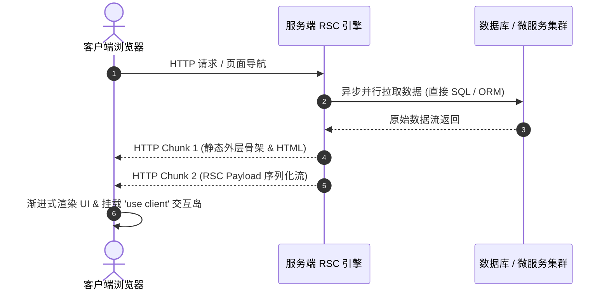

# React 19 Server Components 落地指南

React 19 的正式发布标志着前端组件范式的根本性转变。**React Server Components (RSC)** 与 **Server Actions** 不再仅仅是实验性特性，而是现代前端工程构建高性能、轻量级 Web 应用的核心基础设施。

与传统的客户端渲染 (CSR) 或服务端渲染 (SSR) 相比，RSC 允许开发者在服务端直接运行组件逻辑，零打包体积 (Zero-Bundle-Size) 直出 HTML 与序列化虚拟 DOM 流，彻底解决了海量第三方 npm 包侵蚀客户端首屏加载性能的痛点。

---

## 一、RSC 核心运行机制与数据传输协议

RSC 的精髓在于**组件层级服务端执行**，其与经典 SSR 具有本质区别：

| 特性维度 | 经典 SSR (Server-Side Rendering) | React 19 RSC (Server Components) |
| :--- | :--- | :--- |
| **执行时机** | 首屏请求时在服务端生成 HTML 字符串 | 组件级在服务端按需执行，随时流式响应 |
| **客户端水合 (Hydration)** | 全量 JS 代码均需下载并在客户端完整 Hydrate | 仅客户端标记 (`'use client'`) 组件需要 Hydrate，服务端组件 0 JS |
| **重渲染开销** | 页面切换通常触发全量 CSR 或路由刷新 | 可通过 RSC Payload 进行局部局部重绘，保留客户端状态 |
| **依赖包体积** | 所有导入的格式化、Markdown 工具包均打包进客户端 Bundle | 服务端引用的库直接保留在服务端，客户端下载体积为 **0 KB** |

### RSC Payload 协议与流式传输流程

当服务端执行 RSC 时，并不会直接返回生硬的 HTML 字符串，而是生成包含 React Element 拓扑结构的 **RSC Wire Format (Payload)**：



---

## 二、服务端组件与客户端组件的代码边界设计

在实际落地时，合理划分 **Server Component** 与 **Client Component** 边界是架构设计的重中之重。

### 1. 服务端数据聚合组件 (Server Component)

服务端组件直接对接数据库或后端 RPC 服务，无需额外暴露内部 API 路由：

```tsx
// app/dashboard/ProductList.tsx (默认为 Server Component)
import { db } from '@/lib/db';
import { Suspense } from 'react';
import ProductCard from './ProductCard';
import ProductSkeleton from './ProductSkeleton';

interface ProductListProps {
  category: string;
}

export default async function ProductList({ category }: ProductListProps) {
  // 服务端直接异步获取，无需 useEffect 与额外客户端 fetch
  const products = await db.product.findMany({
    where: { category, inStock: true },
    orderBy: { salesCount: 'desc' },
    take: 20,
  });

  return (
    <div className="grid grid-cols-1 md:grid-cols-3 gap-6">
      {products.map((item) => (
        <Suspense key={item.id} fallback={<ProductSkeleton />}>
          <ProductCard product={item} />
        </Suspense>
      ))}
    </div>
  );
}
```

### 2. 交互隔离型客户端组件 (`'use client'`)

对于包含状态 (`useState`)、副作用 (`useEffect`)、浏览器 DOM 事件监听的组件，精确添加 `'use client'` 标记：

```tsx
// app/dashboard/AddToCartButton.tsx
'use client';

import { useState, useTransition } from 'react';
import { addToCartAction } from '@/actions/cart';

interface ButtonProps {
  productId: string;
}

export default function AddToCartButton({ productId }: ButtonProps) {
  const [isPending, startTransition] = useTransition();
  const [added, setAdded] = useState(false);

  const handleAdd = () => {
    startTransition(async () => {
      const result = await addToCartAction(productId);
      if (result.success) {
        setAdded(true);
      }
    });
  };

  return (
    <button
      onClick={handleAdd}
      disabled={isPending}
      className={`px-4 py-2 rounded font-medium transition ${
        added ? 'bg-emerald-600 text-white' : 'bg-blue-600 hover:bg-blue-700 text-white'
      }`}
    >
      {isPending ? '加购中...' : added ? '已加购 ✓' : '加入购物车'}
    </button>
  );
}
```

---

## 三、React 19 Server Actions 变异与表单优化

React 19 带来了基于 `useActionState` 和 `useOptimistic` 的全新表单变异工作流，无需手动维护繁琐的 `loading`、`error` 与临时乐观状态。

### 生产级 Server Action 示例

```tsx
// actions/user-profile.ts
'use server';

import { z } from 'zod';
import { db } from '@/lib/db';
import { revalidatePath } from 'next/cache';

const ProfileSchema = z.object({
  username: z.string().min(3, '用户名至少 3 个字符').max(20),
  bio: z.string().max(200, '个人简介不能超过 200 字').optional(),
});

export type ActionState = {
  errors?: Record<string, string[]>;
  success?: boolean;
  message?: string;
};

export async function updateProfileAction(
  prevState: ActionState,
  formData: FormData
): Promise<ActionState> {
  const validatedFields = ProfileSchema.safeParse({
    username: formData.get('username'),
    bio: formData.get('bio'),
  });

  if (!validatedFields.success) {
    return {
      errors: validatedFields.error.flatten().fieldErrors,
      success: false,
      message: '表单校验失败，请检查输入项',
    };
  }

  try {
    await db.user.update({
      where: { id: 'current-user-id' },
      data: validatedFields.data,
    });

    // 触发按需缓存再验证
    revalidatePath('/profile');
    return { success: true, message: '个人资料已更新成功！' };
  } catch (error) {
    return {
      success: false,
      message: '数据库写入异常，请稍后重试',
    };
  }
}
```

---

## 四、生产落地避坑指南与 Checklist

1. **避免在客户端组件中向下透传庞大非序列化对象**：传递给 `'use client'` 组件的 Props 必须可通过 JSON/RSC 协议序列化（禁止直接传递函数、Symbol 或未实例化的复杂类）。
2. **警惕服务端瀑布流 (Waterfalls)**：若多个独立的 Server Component 需要调用外部微服务，务必采用 `Promise.all()` 并行发起，或结合 `<Suspense>` 进行分片流式下发。
3. **保持安全性隔离**：Server Action 本质上是公网暴露的 HTTP POST 端点，在 Action 内部必须进行严格的**鉴权校验**与 **Zod 参数校验**，严禁信任客户端传入的用户身份标识。
