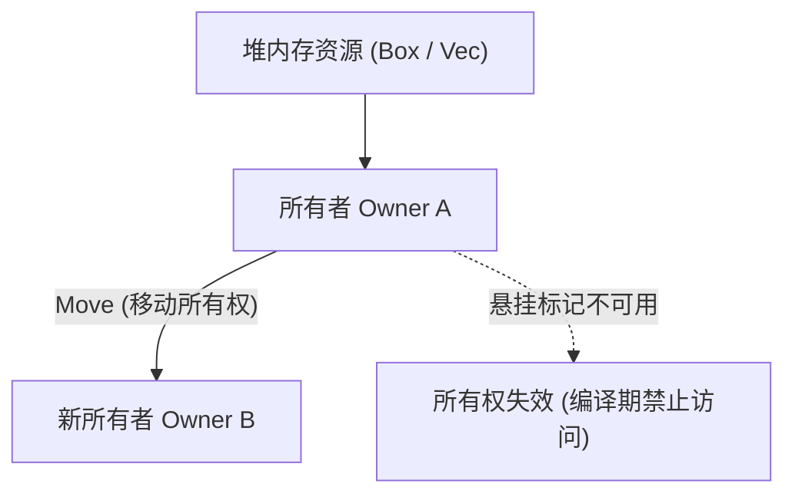

# Rust 所有权模型与无锁并发结构

在传统系统级编程语言（如 C/C++）中，内存管理是一把双刃剑：手动管理赋予了极致的执行性能，但也带来了悬垂指针 (Dangling Pointer)、双重释放 (Double Free) 与数据竞争 (Data Race) 等臭名昭著的安全隐患。

**Rust** 独创了 **所有权 (Ownership)** 与 **生命周期 (Lifetimes)** 静态类型系统，在**编译期**彻底杜绝了内存安全问题且无需垃圾回收器 (GC) 介入。本文将深入其底层原理，并结合 `AtomicPtr` 探索无锁并发编程的实现之道。

---

## 一、所有权与借用检查器：非词法作用域生命周期 (NLL)

Rust 的核心内存契约由三大铁律构成：
1. 每个值在任何时刻有且仅有一个**所有者 (Owner)**；
2. 当所有者离开作用域时，该值占用的内存资源被立即自动释放 (`Drop::drop`)；
3. **借用铁律 (Aliasing XOR Mutability)**：在同一时刻，要么只能拥有任意多个**不可变引用 (`&T`)**，要么只能拥有唯一一个**可变引用 (`&mut T`)**。



### 生命周期标注 `'a` 的本质：编译期泛型约束

生命周期并不是用来延长变量的存活时长，而是**告知编译器各个引用之间的相对存活时间长短关系**：

```rust
// 返回引用的生命周期必须受限于两个入参生命周期的交集 (下界)
fn longest<'a>(x: &'a str, y: &'a str) -> &'a str {
    if x.len() > y.len() {
        x
    } else {
        y
    }
}
```

---

## 二、无锁并发核心：基于 `AtomicPtr` 的 Treiber Stack 实战

传统的并发数据结构使用互斥锁 (`std::sync::Mutex`)，在高并发争用场景下会导致频繁的线程上下文切换与内核态阻塞。

**无锁数据结构 (Lock-Free)** 利用 CPU 提供的原子指令（如 **CAS: Compare-And-Swap**，Rust 中的 `compare_exchange_weak`）实现极速并发：

```rust
use std::sync::atomic::{AtomicPtr, Ordering};
use std::ptr;

// 节点内存结构
struct Node<T> {
    data: T,
    next: *mut Node<T>,
}

/// 工业级无锁栈 (Treiber Stack)
pub struct LockFreeStack<T> {
    head: AtomicPtr<Node<T>>,
}

impl<T> LockFreeStack<T> {
    pub fn new() -> Self {
        Self {
            head: AtomicPtr::new(ptr::null_mut()),
        }
    }

    /// 入栈操作：无锁乐观 CAS 循环
    pub fn push(&self, data: T) {
        // 在堆上分配新节点
        let new_node = Box::into_raw(Box::new(Node {
            data,
            next: ptr::null_mut(),
        }));

        let mut current = self.head.load(Ordering::Relaxed);
        loop {
            // 将新节点的 next 指向当前栈顶
            unsafe {
                (*new_node).next = current;
            }

            // 原子 CAS 替换：若栈顶仍为 current，则更新为 new_node
            match self.head.compare_exchange_weak(
                current,
                new_node,
                Ordering::Release, // 内存屏障：确保写入先于指针公开可见
                Ordering::Relaxed,
            ) {
                Ok(_) => break,
                Err(actual) => current = actual, // CAS 失败，刷新当前栈顶指针并重试
            }
        }
    }

    /// 出栈操作
    pub fn pop(&self) -> Option<T> {
        let mut current = self.head.load(Ordering::Acquire);
        loop {
            if current.is_null() {
                return None;
            }

            let next_ptr = unsafe { (*current).next };

            match self.head.compare_exchange_weak(
                current,
                next_ptr,
                Ordering::Acquire,
                Ordering::Relaxed,
            ) {
                Ok(_) => {
                    // 安全将原始裸指针重新包装为 Box 触发所有权接管
                    let boxed_node = unsafe { Box::from_raw(current) };
                    return Some(boxed_node.data);
                }
                Err(actual) => current = actual,
            }
        }
    }
}

// 自动实现析构释放剩余节点
impl<T> Drop for LockFreeStack<T> {
    fn drop(&mut self) {
        while self.pop().is_some() {}
    }
}
```

---

## 三、内存顺序 (Memory Ordering) 深度解析

在无锁算法中，直接使用 `Ordering::SeqCst`（顺序一致性）虽然最安全，但对硬件总线带宽损耗最大。合理使用 **Acquire-Release 语义** 是极致性能的关键：

| 内存序 (Ordering) | 硬件行为语义 | 典型应用场景 |
| :--- | :--- | :--- |
| **`Relaxed`** | 仅保证原子操作本身的原子性，不对周围指令重排施加任何约束 | 简单的全局计数器、统计打点 |
| **`Release`** | 确保当前线程中所有排在前面的内存写操作在此指令前全部完成 | 生产者准备好数据后发布指针 |
| **`Acquire`** | 确保当前线程中所有排在后面的内存读操作在此指令后才执行 | 消费者获取指针后读取数据内容 |
| **`AcqRel`** | 同时具备 Acquire 与 Release 屏障效果 | 读-改-写 (RMW) 操作，如 Fetch-And-Add |

---

## 四、安全边界与 ABA 问题防治

1. **ABA 问题本质**：当线程 1 读到栈顶为 A，挂起；线程 2 弹出 A、弹出 B，又压入一个恰好地址与 A 相同的节点 A'；线程 1 恢复执行 CAS 成功，但链表拓扑已被破坏。
2. **生产级解决方案**：
   - 使用带有版本代号的复合指针（Tag / Pointer Tagging）；
   - 使用成熟的 Epoch-based 内存回收库（如 `crossbeam-epoch`），确保已被弹出的节点不会在有线程持有时被过早复用。
