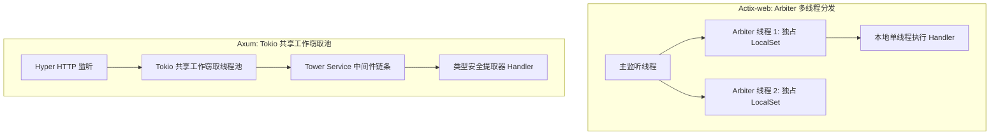

# Actix-web 与 Axum 架构性能实测

在对延迟与高吞吐有极高要求的后端微服务中，Rust 凭借零运行时开销、内存安全与强大的异步生态（Tokio）逐渐成为首选。在众多 Rust Web 框架中，**Actix-web** 与 **Axum** 占据了统治地位。

Actix-web 长期称霸 TechEmpower 性能榜单第一梯队，而由 Tokio 核心团队主导开发的 Axum 则凭借与 **Tower / Hyper** 生态的无缝融合与人体工学设计迅速崛起。

---

## 一、架构设计理念与线程模型对比

| 核心维度 | Actix-web 4.x | Axum 0.7+ |
| :--- | :--- | :--- |
| **设计范式** | 历史源于 Actor 模型，基于专属 Arbiter 线程池与专用事件循环 | 纯函数式组合模型，全面构建在 Tokio + Tower `Service` 之上 |
| **中间件体系** | 专有的 `Transform` 与 `Service` trait 体系 | 标准通用的 **Tower Middleware** 生态（Timeout, Trace, Cors 通用） |
| **状态共享** | `web::Data<T>` (每个 Worker 线程克隆或 Arc 包装) | `State<T>` (基于类型擦除与依赖注入提取器 Extractor) |
| **底层 HTTP 引擎** | 自主研发维护的 `actix-http` 引擎 | 行业事实标准 **Hyper 1.x** (全异步零拷贝) |



---

## 二、生产级代码实现实战

### 1. Axum 现代 API 服务端实现

```rust
// src/main.rs (Axum 示例)
use axum::{
    extract::{Path, State},
    http::StatusCode,
    response::IntoResponse,
    routing::{get, post},
    Json, Router,
};
use serde::{Deserialize, Serialize};
use std::sync::Arc;
use tokio::net::TcpListener;
use tower_http::trace::TraceLayer;

#[derive(Clone)]
struct AppState {
    db_pool: Arc<String>, // 实际业务中为 sqlx::PgPool
}

#[derive(Serialize, Deserialize)]
struct UserDto {
    id: u64,
    username: String,
    role: String,
}

// 强类型 Handler，参数提取器自动完成校验与反序列化
async fn get_user_by_id(
    Path(user_id): Path<u64>,
    State(state): State<AppState>,
) -> Result<Json<UserDto>, StatusCode> {
    if user_id == 0 {
        return Err(StatusCode::NOT_FOUND);
    }

    Ok(Json(UserDto {
        id: user_id,
        username: format!("user_{}", user_id),
        role: "admin".to_string(),
    }))
}

#[tokio::main]
async fn main() {
    tracing_subscriber::fmt::init();

    let shared_state = AppState {
        db_pool: Arc::new("postgresql://localhost:5432/app".to_string()),
    };

    let app = Router::new()
        .route("/api/users/{id}", get(get_user_by_id))
        .layer(TraceLayer::new_for_http())
        .with_state(shared_state);

    let listener = TcpListener::bind("0.0.0.0:8080").await.unwrap();
    println!("🚀 Axum HTTP server running on port 8080");
    axum::serve(listener, app).await.unwrap();
}
```

---

## 三、性能基准压测 (wrk Benchmark)

测试环境：16 Core AMD EPYC, 32GB RAM, Ubuntu 24.04 LTS, 100 并发连接，持续 30 秒：

```text
# 测试命令：
wrk -t8 -c100 -d30s --latency http://127.0.0.1:8080/api/users/1024
```

| 评估指标 | Actix-web (4.9) | Axum (0.7.5) | 差异分析 |
| :--- | :--- | :--- | :--- |
| **QPS (Requests/sec)** | **312,450 req/s** | **298,800 req/s** | Actix-web 略高 ~4.5%（专有事件循环的微弱优势） |
| **平均延迟 (Avg Latency)** | **0.31 ms** | **0.33 ms** | 均在亚毫秒级别，无显著感知差异 |
| **P99 延迟** | **0.82 ms** | **0.78 ms** | Axum 工作窃取调度器在长尾毛刺控制上表现更平稳 |
| **内存占用 (RSS)** | 24 MB | 19 MB | Axum 内存占用更轻量 |

---

## 四、选型决策指南

- **选择 Axum 的场景（推荐大多数企业级服务）**：
  1. 需要与 Tokio 整个生态体系（Tonic gRPC、Tower、Hyper）深度协同；
  2. 极度看重代码的人体工学可读性与通用中间件生态；
  3. 团队希望遵循 Rust 官方标准最佳实践。
- **选择 Actix-web 的场景**：
  1. 追求极限理论压测峰值 QPS；
  2. 现有大型系统已重度依赖 Actix Actor 架构体系。
