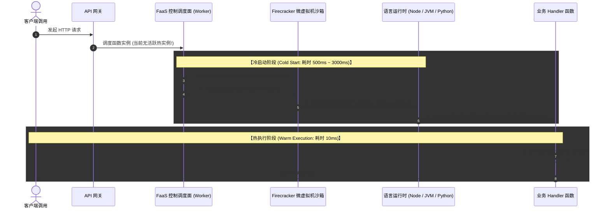

# Serverless 冷启动物理机理与优化

**无服务器计算 (Serverless / FaaS，函数即服务)** 凭借“按请求计费（闲置 0 成本）、全自动秒级弹性扩缩容、完全免除服务器运维负担”的特性，正在深刻重构现代后端开发。

然而，Serverless 架构存在一个最令人诟病的体验瓶颈 —— **冷启动 (Cold Start)**。当一个函数在空闲一段时间后首次被触发，或突发流量要求 FaaS 平台动态创建新的并发实例时，请求延迟可能从原本的 10ms 骤增至 **1 秒乃至 5 秒以上**，导致用户体验严重受损。

---

## 一、冷启动物理全生命周期拆解



---

## 二、不同语言运行时的冷启动耗时基准

由于虚拟机的内存占用与类加载机制不同，不同编程语言的冷启动时间存在数量级差异：

| 运行时语言 | 典型冷启动耗时 (128MB~512MB 内存) | 典型热执行耗时 | 选型建议 |
| :--- | :--- | :--- | :--- |
| **Rust / Go / C++ (编译型)** | **~15 ms - 35 ms (极速)** | **< 5 ms** | 超高频实时 API、极速网关鉴权第一首选 |
| **Node.js / Python (解释型)** | **~80 ms - 250 ms (较快)** | ~10 ms - 20 ms | 常规 CRUD 业务、事件处理首选 |
| **Java (JVM) / .NET** | **~1500 ms - 4500 ms (极慢)** | ~8 ms (JIT 预热后) | 若无快照恢复技术，严禁直接裸跑 FaaS API |

---

## 三、三大战术级极限优化方案

### 1. 代码打包层：Tree-Shaking 与依赖极致轻量化

许多 Node.js 函数包体积高达 50MB（包含了整个 `aws-sdk` 与重型 ORM），导致解压下载阶段耗时极长：

```javascript
// ❌ 错误写法：全局导入整个庞大的 SDK (耗时增加 300ms)
import AWS from 'aws-sdk';
const s3 = new AWS.S3();

// ✅ 最佳实践：按需导入模块化客户端 (AWS SDK v3)，打包体积缩小 95%
import { S3Client, GetObjectCommand } from '@aws-sdk/client-s3';
const s3Client = new S3Client({});
```

使用 **esbuild / rollup** 进行单文件打包并开启代码压缩与死代码剔除（Tree-shaking），将函数包压缩在 **1MB 以内**。

---

### 2. 快照恢复技术：AWS Lambda SnapStart / Firecracker 快照

**SnapStart** 彻底颠覆了传统运行时的启动流程：
1. 在函数部署发布（Publish Version）时，FaaS 平台预先启动一次实例，完成语言运行时、类加载以及数据库连接池的**全局初始化**；
2. 平台在内存就绪时刻对整个 MicroVM 内存和磁盘状态拍摄一份**加密快照 (Memory Snapshot)** 并持久化缓存；
3. 当后续发生冷启动时，**直接将快照按页恢复（Page Cache Fault 快速加载）**，将 Java 的冷启动时间从 4 秒直接骤降至 **100 毫秒以内**！

```java
// Java Lambda 接入 CRaC / SnapStart 生命周期感知
public class OrderHandler implements RequestHandler<APIGatewayProxyRequestEvent, APIGatewayProxyResponseEvent>, 
    org.crac.Resource {

    public OrderHandler() {
        // 在构建期拍摄快照前预热 DB 连接池
        DatabasePool.prewarm();
        Core.getGlobalContext().register(this);
    }

    @Override
    public void beforeCheckpoint(org.crac.Context<? extends org.crac.Resource> context) {
        // 拍摄快照前：安全关闭网络长连接，防止快照恢复后套接字失效
        DatabasePool.disconnect();
    }

    @Override
    public void afterRestore(org.crac.Context<? extends org.crac.Resource> context) {
        // 快照恢复瞬间：毫秒级重新连接 DB 并重置随机数种子
        DatabasePool.reconnect();
    }
}
```

---

### 3. 预留并发 (Provisioned Concurrency) 保底

对于大促秒杀或严苛 SLA 场景（如支付通知），在云厂商控制面配置 **预留并发实例池**：
- 提前常驻指定数量的完全热实例；
- 配合自动扩缩容策略（Auto-Scaling），在流量洪峰到来前 10 分钟按定时计划梯度增加预留实例。
