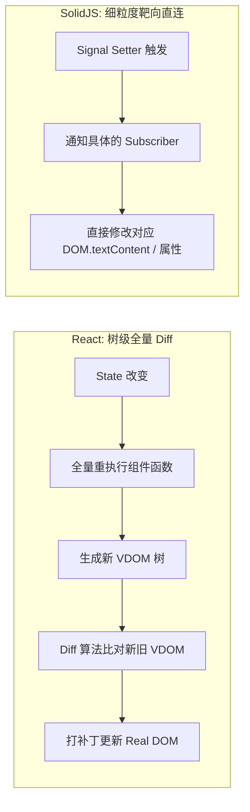

# SolidJS 细粒度响应式前端探索

在过去十年中，基于 Virtual DOM (VDOM) 与全量 Diff 算法的前端框架（以 React 为代表）统领了 Web 界面开发的生态体系。然而，VDOM 的本质是用“昂贵的内存对象树开销与树级 Diff 比较”来换取声明式编程体验。

**SolidJS** 另辟蹊径，依托 **细粒度响应式 (Fine-grained Reactivity)** 与强大的 **AOT (Ahead-of-Time) JSX 编译器**，在完全保留 JSX 灵活语法的前提下，实现了**无 Virtual DOM、组件函数仅执行一次、DOM 节点靶向精确更新**的极致性能突破。

---

## 一、SolidJS vs React：执行模型与生命周期的本质分野

理解 SolidJS 最关键的心智模型转变在于：**组件函数（Component Function）不是渲染函数，它只是一个一次性的构造器 (Setup Function)**。

| 核心维度 | React 18 / 19 渲染模型 | SolidJS 响应式执行模型 |
| :--- | :--- | :--- |
| **组件生命周期** | 状态变更触发整个组件函数自顶向下重新执行 (Re-render) | 组件函数**仅在初始化挂载时执行一次**，之后永远不再运行 |
| **状态载体 (State)** | `useState` 闭包快照，每次 Render 生成全新快照 | `createSignal` 依赖追踪器，返回 Getter 与 Setter 函数 |
| **更新开销** | 递归生成 VDOM 树 -> 树 Diff 算法 -> 批量打补丁到 Real DOM | Signal 变更直接触发订阅该 Signal 的特定 DOM 文本节点或属性修改 |
| **Hook 规则约束** | 严禁在条件语句、循环或回调中调用 Hook | 无任何 Hook 调用顺序限制，Signal 可在任意作用域自由定义 |



---

## 二、底层核心：手写微型 Signal 响应式依赖图

SolidJS 的底层核心由 `createSignal`、`createEffect` 与响应式追踪栈 `ListenerContext` 构成。其核心运行逻辑如下：

```typescript
// 极简微型响应式运行时实现
type EffectFn = () => void;

// 全局当前正在执行的副作用指针
let currentListener: EffectFn | null = null;

export function createSignal<T>(initialValue: T): [() => T, (nextValue: T | ((prev: T) => T)) => void] {
  let value = initialValue;
  // 维护订阅当前 Signal 的所有观察者集合
  const subscribers = new Set<EffectFn>();

  const read = () => {
    // 自动依赖收集：如果当前有正在执行的 Effect，将其注册为观察者
    if (currentListener) {
      subscribers.add(currentListener);
    }
    return value;
  };

  const write = (nextValue: T | ((prev: T) => T)) => {
    const resolvedValue =
      typeof nextValue === 'function'
        ? (nextValue as (prev: T) => T)(value)
        : nextValue;

    if (resolvedValue !== value) {
      value = resolvedValue;
      // 派发更新：精准通知依赖此 Signal 的副作用函数重新执行
      subscribers.forEach((fn) => fn());
    }
  };

  return [read, write];
}

export function createEffect(fn: EffectFn): void {
  const execute = () => {
    currentListener = execute;
    try {
      fn();
    } finally {
      currentListener = null;
    }
  };

  // 初始执行一次以收集依赖
  execute();
}
```

---

## 三、编译期魔法：JSX 到真实 DOM 原语的转换

SolidJS 的 Babel/Vite 插件在构建期会将 JSX 编译为原生的 DOM 创建与属性模板克隆指令，而非 `React.createElement`。

### 源码 JSX 书写方式：

```tsx
// Counter.tsx
import { createSignal, createEffect, onCleanup } from 'solid-js';

export function Counter() {
  const [count, setCount] = createSignal(0);
  const [multiplier, setMultiplier] = createSignal(2);

  // 派生计算属性 (无需 useMemo，普通函数即具响应式)
  const product = () => count() * multiplier();

  const timer = setInterval(() => {
    setCount((c) => c + 1);
  }, 1000);

  onCleanup(() => clearInterval(timer));

  return (
    <div class="counter-card p-6 bg-slate-900 text-white rounded-xl shadow-lg">
      <h2 class="text-xl font-bold">SolidJS 实时计数器</h2>
      <p class="mt-2 text-slate-400">
        当前基础计数值: <span class="font-mono text-emerald-400">{count()}</span>
      </p>
      <p class="mt-1 text-slate-400">
        乘积计算结果: <span class="font-mono text-cyan-400">{product()}</span>
      </p>
      <div class="mt-4 flex gap-3">
        <button
          onClick={() => setCount((c) => c + 1)}
          class="px-4 py-2 bg-emerald-600 hover:bg-emerald-500 rounded font-semibold"
        >
          增加计数 (+1)
        </button>
        <button
          onClick={() => setMultiplier((m) => m + 1)}
          class="px-4 py-2 bg-cyan-600 hover:bg-cyan-500 rounded font-semibold"
        >
          调整倍率 ({multiplier()}x)
        </button>
      </div>
    </div>
  );
}
```

### 编译器输出的原生 JS（原理示意）：

```javascript
// 编译产物示意：0 虚拟 DOM，直接克隆 HTML 模板
const _tmpl$ = document.createElement("template");
_tmpl$.innerHTML = `<div class="counter-card..."><h2.../p><p.../div>`;

export function Counter() {
  const [count, setCount] = createSignal(0);
  const [multiplier, setMultiplier] = createSignal(2);
  const product = () => count() * multiplier();

  const _root = _tmpl$.content.firstChild.cloneNode(true);
  const _spanCount = _root.childNodes[1].childNodes[1];
  const _spanProduct = _root.childNodes[2].childNodes[1];

  // 仅将 DOM textContent 的更新与 Signal Getter 绑定
  createEffect(() => _spanCount.textContent = count());
  createEffect(() => _spanProduct.textContent = product());

  return _root;
}
```

---

## 四、SolidJS 在高频实时场景下的工程实践

1. **绝对不要解构 Props**：在 SolidJS 中，Props 本质是一个 Proxy 对象。解构 Props（例如 `const { title } = props`）会立即丢失其响应式追踪能力，必须使用 `props.title` 或 `splitProps()` 工具函数。
2. **列表渲染优先选用 `<For>` 组件**：`<For>` 原语内置了基于引用身份的高效 DOM 节点缓存机制，在海量数据流（如股票行情、实时日志监控大屏）中，能做到 0 GC 垃圾回收压力与满帧 120 FPS 的平滑更新。
3. **配合 SolidStart 构建全栈体系**：SolidStart 支持流式 SSR 与 Islands 架构，为追求极致加载速度与运行性能的企业级系统提供了全新的架构标杆。
