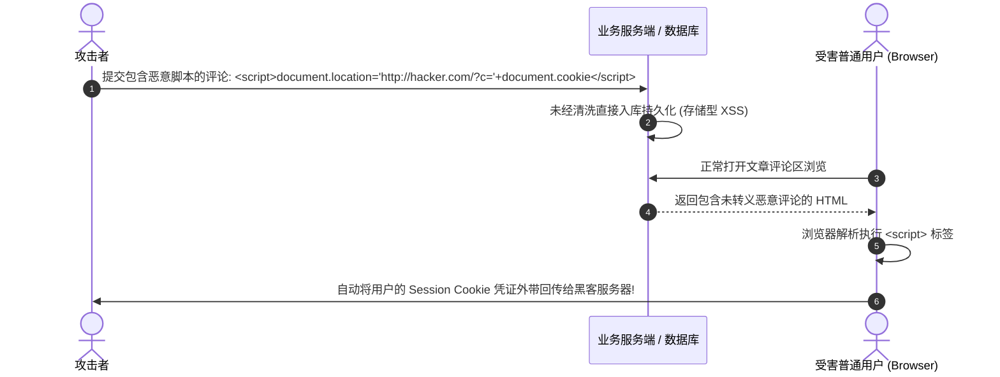

# Web 安全：SQL 注入与 XSS 纵深防御

在 OWASP Top 10 Web 安全威胁排行榜中，**SQL 注入 (SQL Injection, SQLi)** 与 **跨站脚本攻击 (Cross-Site Scripting, XSS)** 长期位居破坏力与发生频率最高的前列。

SQL 注入允许攻击者绕过身份验证、窃取甚至清空整个核心数据库；而 XSS 允许攻击者在受害者的浏览器中注入并执行恶意 JavaScript 代码，窃取敏感的 Session Cookie 凭证、劫持用户会话或发起蠕虫传播。

本文将从编译解析器底层与浏览器安全沙箱视角，系统剖析这两大漏洞的产生根因与**纵深防御体系 (Defense-in-Depth)**。

---

## 一、SQL 注入物理根因：AST (抽象语法树) 边界被恶意篡改

SQL 注入的本质在于：**服务端将未经严格校验的用户外部不可信输入，通过简单的字符串拼接组装成了 SQL 指令，导致数据库 SQL 词法/语法解析器在构建 AST 时，将“数据内容”误识别为了“执行指令逻辑”**。

```mermaid
graph TD
    subgraph Vulnerable_SQL [漏洞拼接: ' OR 1=1 --]
        RawStr["SELECT * FROM users WHERE user = '' + input + '' AND pass = '' + pass + ''"] --> Lexer1[词法解析]
        Lexer1 --> AST1["AST 语法树被恶意注入 OR 节点, 永远判定为 TRUE! 身份验证被完全绕过!"]
    end

    subgraph Prepared_Statement [参数化预编译 (Prepared Statement): 指令与数据物理隔离]
        Template[SELECT * FROM users WHERE user = ? AND pass = ?] --> PreCompile["1. 数据库预先编译 AST 语法树骨架 (固定逻辑结构)"]
        UserInput["2. 传入外部不可信参数: ' OR 1=1 --"] --> SafeBind["3. 数据库纯粹作为字面量值绑定, 绝不改变任何 AST 结构!"]
    end
```

### 生产级安全防御：严格采用参数化查询

```typescript
// ❌ 存在致命 SQL 注入隐患的错误写法 (千万不要手动拼 SQL!)
const query = `SELECT * FROM users WHERE username = '${req.body.username}'`;
await db.query(query);

// ✅ 工业界标准：利用驱动层参数化预编译 (Prepared Statement)
const safeQuery = 'SELECT id, username, email FROM users WHERE username = $1 AND is_active = $2';
const result = await db.query(safeQuery, [req.body.username, true]);
```

---

## 二、XSS 跨站脚本攻击三大类型与执行机制

| XSS 类型 | 恶意代码来源 | 触发执行时机 | 危害程度 |
| :--- | :--- | :--- | :--- |
| **存储型 (Stored XSS)** | 攻击者将恶意脚本（如 `<script>stealCookie()</script>`）提交至数据库（如文章评论、用户昵称） | **所有访问该页面的正常用户**从数据库加载渲染时均被无差别攻击 | **极高（可引发全站级 XSS 蠕虫）** |
| **反射型 (Reflected XSS)** | 恶意脚本嵌入在 URL 参数中（如 `https://site.com/search?q=<script>...`） | 受害者被诱导点击恶意钓鱼链接时触发一次性执行 | 较高（多用于针对特定高管的定向钓鱼） |
| **DOM 型 (DOM-based XSS)** | 恶意 payload 存在于 URL hash 或客户端输入，由前端 JS 代码直接取出并 `innerHTML` | **纯前端客户端 JavaScript 处理不当导致**，恶意代码甚至完全不经过后端服务器 | 高（隐蔽性强，后端 WAF 往往无法察觉） |



---

## 三、前端纵深防御实操：DOMPurify 与 CSP 内容安全策略

### 1. 前端富文本安全清洗 (DOMPurify)

在必须渲染用户富文本 HTML 的场景中（如 Markdown 渲染器），严禁直接裸传 `dangerouslySetInnerHTML`：

```tsx
// components/SafeRichText.tsx
import DOMPurify from 'dompurify';

interface SafeRichTextProps {
  rawHtml: string;
}

export function SafeRichText({ rawHtml }: SafeRichTextProps) {
  // 严格白名单过滤：剔除所有 script, iframe, onload 等高危标签与属性
  const cleanHtml = DOMPurify.sanitize(rawHtml, {
    ALLOWED_TAGS: ['p', 'b', 'i', 'em', 'strong', 'a', 'h1', 'h2', 'ul', 'li', 'code', 'pre', 'img'],
    ALLOWED_ATTR: ['href', 'src', 'alt', 'title', 'class'],
  });

  return <div className="prose" dangerouslySetInnerHTML={{ __html: cleanHtml }} />;
}
```

### 2. 部署坚固的 Content-Security-Policy (CSP) 响应头

CSP 告知浏览器只信任并执行来自指定安全源的脚本，**即使页面存在 XSS 注入点，浏览器也会强行拒绝执行未经授权的脚本与内联代码**：

```http
Content-Security-Policy: default-src 'self'; script-src 'self' 'nonce-rAnd0m123' https://trusted-cdn.com; style-src 'self' 'unsafe-inline' https://fonts.googleapis.com; img-src 'self' data: https://images.unsplash.com; connect-src 'self' https://api.internal.org; object-src 'none'; frame-ancestors 'none';
```

---

## 四、安全合规核心 Checklist

1. **敏感 Cookie 必须开启 `HttpOnly` 与 `SameSite=Lax/Strict`**：使 JavaScript 无法通过 `document.cookie` 访问 Session Token，即使遭遇 XSS 也能保全用户登录凭据。
2. **永远在服务端进行二次防御校验**：永远不要轻信前端传入的任何参数。客户端的过滤极易被 Postman 或中间人代理直接绕过。
