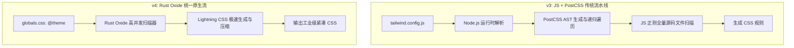

# Tailwind CSS v4 架构重构与 JIT 引擎

随着 Web 前端工程对构建速度与标准化 CSS 规范的要求日益严苛，Tailwind CSS 推出了划时代的 **v4.0 版本**。这一版本并非简单的特性增补，而是对其底层核心的一次**自底向上彻底重写**。

v4 彻底废弃了长期以来的 JavaScript 配置文件体系（如 `tailwind.config.js`），全面拥抱 **CSS-First** 配置范式，并基于 Rust 打造了全新专属的 **Oxide 编译引擎** 与 **Lightning CSS** 解析管线，使大型项目的全量与增量构建速度实现了 **5 到 10 倍** 的飞跃。

---

## 一、v3 vs v4：核心架构演进全景对比

| 架构维度 | Tailwind CSS v3 | Tailwind CSS v4 |
| :--- | :--- | :--- |
| **配置文件** | `tailwind.config.js` / `ts` 复杂 JS 导出对象 | 纯原生 CSS 文件，通过 `@theme` 与 `@utility` 指令配置 |
| **底层引擎** | Node.js + PostCSS 插件生态 | **Oxide 引擎** (Rust 编写) + **Lightning CSS** 极速解析 |
| **增量编译速度** | 200ms - 800ms (大型工程) | **10ms - 35ms** (几乎瞬时完成) |
| **依赖项体积** | 庞大的 Node 模块树 (PostCSS, Autoprefixer, lodash) | 零复杂胶水依赖，单个独立可执行二进制或轻量插件 |
| **现代 CSS 支持** | 需配置繁琐的 Polyfill 插件 | 原生支持 `@layer`、`@container`、原生嵌套与 Color-Mix |



---

## 二、CSS-First 配置实战：原生 `@theme` 体系

在 v4 中，团队的设计规范（Design Tokens）直接以原生 CSS 变量形式定义在 CSS 文件入口中，彻底消除 JS 配置与 CSS 之间的割裂感：

```css
/* src/styles/global.css */
@import "tailwindcss";

/* 定义全局设计令牌 (Design Tokens) */
@theme {
  --font-display: 'Inter', system-ui, sans-serif;
  --font-mono: 'JetBrains Mono', monospace;

  /* 扩展自定义品牌色板 */
  --color-brand-50: oklch(0.97 0.02 240);
  --color-brand-500: oklch(0.58 0.23 255);
  --color-brand-900: oklch(0.24 0.12 260);

  /* 自定义断点系统 */
  --breakpoint-3xl: 1920px;

  /* 自定义动画曲线 */
  --ease-fluid: cubic-bezier(0.3, 0, 0, 1);
}

/* 自定义复合实用类 (Custom Utilities) */
@utility glass-panel {
  background: rgba(255, 255, 255, 0.05);
  backdrop-filter: blur(16px);
  border: 1px solid rgba(255, 255, 255, 0.1);
  box-shadow: 0 8px 32px 0 rgba(0, 0, 0, 0.37);
}

/* 动态自定义变体 (Custom Variants) */
@variant pointer-coarse {
  @media (pointer: coarse) {
    @slot;
  }
}
```

---

## 三、生产构建接入与 Vite / Rsbuild 配置实操

Tailwind CSS v4 提供了官方专用的 `@tailwindcss/vite` 与 `@tailwindcss/postcss` 插件，接入体验更加极简纯粹。

### Vite 项目配置示例：

```typescript
// vite.config.ts
import { defineConfig } from 'vite';
import tailwindcss from '@tailwindcss/vite';
import react from '@vitejs/plugin-react';

export default defineConfig({
  plugins: [
    tailwindcss(), // 自动挂载 Oxide Rust 编译器
    react(),
  ],
});
```

### 实际组件中无缝使用现代 CSS 特性：

```tsx
// components/HeroCard.tsx
export function HeroCard() {
  return (
    <div className="glass-panel p-8 rounded-2xl max-w-xl mx-auto transition-all duration-500 hover:scale-[1.02] ease-fluid">
      <div className="inline-flex items-center gap-2 px-3 py-1 rounded-full bg-brand-500/10 text-brand-500 text-sm font-semibold">
        <span className="w-2 h-2 rounded-full bg-brand-500 animate-pulse" />
        Tailwind CSS v4.0 Active
      </div>

      <h1 className="mt-4 text-3xl font-display font-bold text-slate-100">
        次时代极速构建体验
      </h1>

      <p className="mt-3 text-slate-400 leading-relaxed">
        基于 Rust Oxide 引擎与 Lightning CSS，体验亚毫秒级的热更新速度，彻底告别沉重的配置负担。
      </p>

      <button className="mt-6 px-5 py-2.5 bg-brand-500 hover:bg-brand-900 text-white font-medium rounded-lg transition-colors pointer-coarse:py-4">
        立即探索
      </button>
    </div>
  );
}
```

---

## 四、v3 到 v4 平滑迁移建议与避坑清单

1. **废弃 `@apply` 滥用**：v4 极力倡导优先使用 `@utility` 语法定义复用规则，避免在多层级 SCSS/CSS 中嵌套深度 `@apply`，以保证源码解析的高性能。
2. **OKLCH 色彩空间默认采用**：v4 默认采用 `oklch()` 现代色彩模型，能呈现更宽广的色域与感知均匀的明度渐变。在处理旧版十六进制 HEX 色值时，推荐使用官方自动化迁移工具 `npx @tailwindcss/upgrade` 进行一键转换。
3. **内容扫描无需显式 `content` 数组**：Oxide 引擎会自动智能探测项目根目录下的所有代码文件，无需再手动在配置中编写臃肿易漏的 glob 匹配路径。
