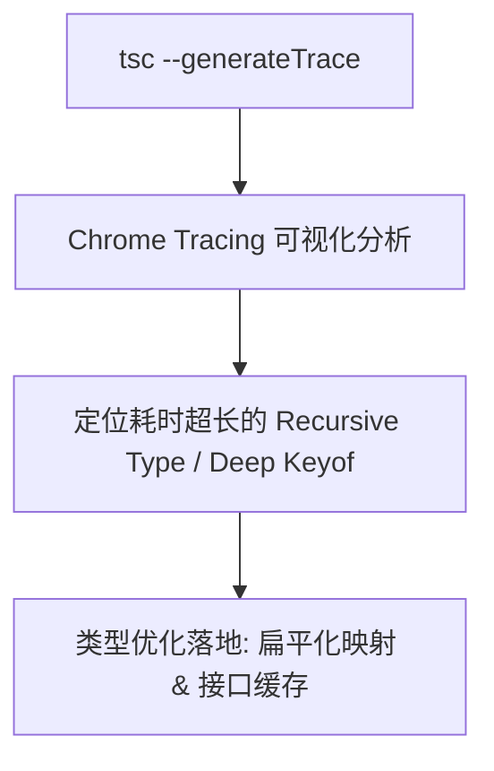

# TypeScript 5.4+ 核心特性与性能调优

随着 TypeScript 在大型企业级 monorepo 与全栈架构中的广泛普及，类型系统的复杂度呈现指数级增长。开发者不仅需要利用高级类型保障运行时的类型安全，更面临着 `tsc` 编译耗时膨胀、IDE 语言服务卡顿等工程瓶颈。

TypeScript 5.4 版本带来了诸如 **`NoInfer<T>`** 工具类型、**闭包上下文类型缩小自动保留** 等关键增强，并在类型检查算法上进行了深层次的算力剪枝。

---

## 一、核心特性 1：`NoInfer<T>` 阻断非预期类型推导

在以往泛型推导中，TypeScript 会从所有传入参数中共同推导类型联合。这在“候选集合 + 默认值”场景下经常产生不符合预期的宽泛类型。

### 痛点与解决方案代码对比：

```typescript
// 场景：定义一个选择器函数，仅允许在 candidates 中选择 defaultValue

// ❌ 传统 TS 5.3 之前的写法：
function selectTheme<T extends string>(candidates: T[], defaultValue: T): T {
  return candidates.includes(defaultValue) ? defaultValue : candidates[0];
}

// 错误调用：'forest' 拼写错误，本应报错，但 TS 自动推导 T = "light" | "dark" | "forest"，导致类型漏网！
const currentTheme = selectTheme(["light", "dark"], "forest");


// ✅ TypeScript 5.4 引入 NoInfer<T>：
function selectThemeStrict<T extends string>(
  candidates: T[],
  defaultValue: NoInfer<T> // 显式阻止 TS 从 defaultValue 推导 T
): T {
  return candidates.includes(defaultValue) ? defaultValue : candidates[0];
}

// 编译时即刻捕获错误：Argument of type '"forest"' is not assignable to parameter of type '"light" | "dark"'.
const fixedTheme = selectThemeStrict(["light", "dark"], "forest");
```

---

## 二、核心特性 2：闭包与回调中的智能类型缩小 (Preserved Narrowing)

在 TS 5.4 之前，当对可变变量进行类型守卫（Type Guard）后，如果在嵌套的回调函数或闭包中访问该变量，类型守卫会被立即重置为原始联合类型（因为 TS 无法确信回调何时执行）。

TS 5.4 增强了静态控制流分析，**自动检测变量在闭包定义后是否被重新赋值**：

```typescript
function processApiResponse(url: string, payload: string | null) {
  if (payload !== null) {
    // 变量 payload 在守卫后从未被重新赋值 (Non-mutated)
    const sendData = () => {
      // 在 TS 5.3 中：payload 依然被推断为 string | null (需手动 ! 强转)
      // 在 TS 5.4+ 中：智能保留收窄结果，推断为 string
      console.log(`Sending payload length: ${payload.length}`);
    };

    fetch(url, { body: payload }).then(sendData);
  }
}
```

---

## 三、大型工程 `tsc` 编译耗时诊断与类型热点调优

当 Monorepo 中代码行数突破数十万行时，类型检查时间可能从几秒恶化至数分钟。

### 1. 运行内置性能诊断探针

```bash
# 生成详细的编译阶段耗时与实例化统计
npx tsc --noEmit --extendedDiagnostics
```

关键输出指标分析：

```text
Files:                         1250
Lines of Library code:         284100
Lines of TypeScript code:      192000
Identifiers:                   185200
Symbols:                       452100
Types:                         120300
Instantiations:                1890200  <--- 核心关注：类型实例化次数
Check time:                    4.21s
Total time:                    5.82s
```

### 2. 生成 Trace 分析火焰图定位热点类型

```bash
# 生成性能分析追踪 JSON 文件
npx tsc --noEmit --generateTrace ./tsc-trace
```

在 Chrome 中打开 `chrome://tracing`，加载生成的 `trace.json`，直接定位最耗时的类型比对节点。



### 3. 类型优化四大军规

1. **优先使用 `interface` 替代复杂交叉类型 (`&`)**：`interface` 具备类型命名索引与符号声明合并缓存，比匿名交叉类型对象快 30% 以上。
2. **避免深度无底线的递归条件类型**：对于 JSON Schema 或深层对象路径解析，限制最大递归深度（例如通过计数器元组控制在 5 层以内）。
3. **隔离复杂的外部三方 `.d.ts`**：在 `tsconfig.json` 中开启 `skipLibCheck: true`，大幅跳过无谓的依赖包重复校验。
