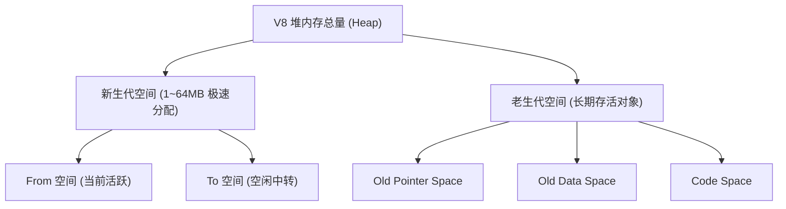
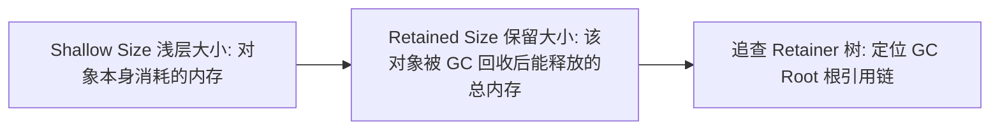

# Chrome V8 垃圾回收与内存泄漏排查

JavaScript 作为一门具备自动内存管理（Automatic Memory Management）的高级语言，其执行速度与流畅度高度依赖底层引擎的垃圾回收器（Garbage Collector, GC）。在 Chrome 浏览器与 Node.js 服务端应用中，**V8 引擎** 承担着内存分配与回收的重任。

当系统内存占用持续单调爬升、页面产生严重掉帧或 Node.js 服务进程因 `JavaScript heap out of memory` 崩溃时，往往意味着代码中存在**对象未释放导致的内存泄漏 (Memory Leak)**。

---

## 一、V8 堆内存分代模型与 GC 算法演进

V8 将堆内存划分为 **新生代 (Young Generation)** 与 **老生代 (Old Generation)**，分别基于不同的弱分代假说（Weak Generational Hypothesis）采用最适配的回收算法：



### 1. 新生代：Cheney 复制算法 (Scavenge)

新生代对象生命周期极短（“朝生夕灭”），V8 使用 Semi-space 将空间对半划分为 **From 空间** 与 **To 空间**：
1. 新对象默认分配至 From 空间。
2. 触发 Minor GC 时，检查 From 空间存活对象并紧密复制到 To 空间（自动消除内存碎片）。
3. 清空 From 空间，随后 From 与 To 角色对调。
4. **对象晋升 (Promotion)**：若对象经历过一次 Scavenge 仍存活，或 To 空间使用率超过 25%，对象将直接晋升到老生代。

### 2. 老生代：三色标记法与并发标记 (Orinoco 架构)

老生代内存容量巨大，采用 **标记-清除 (Mark-Sweep)** 与 **标记-整理 (Mark-Compact)** 算法：

| 标记颜色 | 状态定义 | 遍历阶段操作 |
| :--- | :--- | :--- |
| **白色 (White)** | 未访问节点 | 初始状态。若 GC 结束仍为白色，说明不可达，予以回收 |
| **灰色 (Grey)** | 自身已被访问，但其引用的子对象尚未遍历 | 压入 GC 工作队列，待后续进一步扫描 |
| **黑色 (Black)** | 自身及其所有直接引用的子对象均已被完全扫描 | 确认存活，保留在内存中 |

为了消灭全停顿（Stop-The-World, STW），V8 引入了 **Orinoco** 机制：
- **并发标记 (Concurrent Marking)**：工作线程在主线程执行 JS 的同时在后台进行三色标记。
- **写屏障 (Write Barrier)**：当主线程修改黑白对象引用时，立即将新引用的白色对象变灰，防止误回收。
- **增量整理 (Incremental Compaction)**：将内存碎片整理切片为多个极短的微任务执行。

---

## 二、生产环境常见内存泄漏代码实录

### 1. 隐式闭包共享作用域导致的悬挂引用

```javascript
// 典型的闭包内存泄漏范例
let leakRunner = null;

function produceLeak() {
  const massiveData = new Array(1000000).fill('leak_payload_data'); // 占用约 8MB

  // 函数 outerCls 引用了 massiveData
  const unusedCls = function () {
    if (massiveData) console.log('Used');
  };

  // leakRunner 引用了与 unusedCls 同一个外层词法环境 (Lexical Environment)
  // 导致 massiveData 无法被 V8 释放！
  return function () {
    console.log('Active runner');
  };
}

// 模拟反复调用
setInterval(() => {
  leakRunner = produceLeak();
}, 100);
```

### 2. 未注销的事件监听器与全局 Map 强引用

```javascript
// 错误写法：全局 Map 强引用造成无限制增长
const userSessionCache = new Map();

function loginUser(userId, meta) {
  userSessionCache.set(userId, meta); // 长期不删，无法被 GC 回收
}

// 正确方案：对于关联生命周期的临时数据，使用 WeakMap / WeakSet
const safeSessionCache = new WeakMap();
```

---

## 三、Chrome DevTools & Node.js 堆快照排查实战

### 1. 生成堆快照 (Heap Snapshot)

在 Node.js 服务中，可以通过内置 `v8` 模块或 `--inspect` 参数动态捕获快照：

```javascript
import v8 from 'node:v8';
import fs from 'node:fs';

export function dumpMemorySnapshot(fileName = 'heap-dump.heapsnapshot') {
  const snapshotStream = v8.getHeapSnapshot();
  const fileStream = fs.createWriteStream(fileName);
  snapshotStream.pipe(fileStream);
  fileStream.on('finish', () => {
    console.log(`Heap snapshot successfully saved to: ${fileName}`);
  });
}
```

### 2. 核心排查技巧：三大指标与比对视图

在 Chrome DevTools -> **Memory** 面板载入两个不同时期的快照文件：

```
[视图切换] -> 选择 "Comparison" (对比视图)
[排序依据] -> 按 "# Delta" (对象增量) 与 "Alloc. Size" (分配大小) 降序排列
```



1. **定位异常 Retained Size**：寻找浅层体积小但保留体积巨大的孤儿根节点。
2. **观察 Retainer 引用树**：从黄色的悬挂对象一直向上追溯到 `window`、全局模块或未清理的定时器句柄。
3. **修复后再次录制比对**：确认在连续触发垃圾回收按钮（垃圾桶图标）后，堆内存曲线能否回落到健康基线。
