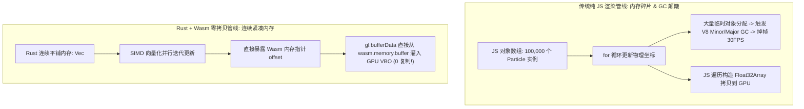

# WebAssembly + Rust 高性能图形渲染

随着数据可视化、CAD 建模工具（如 Figma）、在线视频剪辑与 Web 3D 游戏的兴起，纯 JavaScript 在面对海量密集数学运算与图形顶点变换时往往遭遇性能瓶颈（V8 JIT 反复去优化、垃圾回收 GC 周期性卡顿）。

**Rust 结合 WebAssembly (Wasm)** 提供了一条无开销抽象的解决之道：在底层通过 Rust 编写紧凑、无 GC 的物理计算与空间索引算法，利用 **Wasm 线性内存 (Linear Memory)** 与 WebGL / WebGPU 共享缓冲区，实现**零拷贝 (Zero-Copy) 数据传递**与丝滑的 60/120 FPS 渲染。

---

## 一、为什么纯 JS 处理高密度图形会卡顿？



---

## 二、Rust 高性能粒子物理引擎核心实现

```rust
// src/lib.rs
use wasm_bindgen::prelude::*;

// 强制内存紧凑连续对齐 (每个粒子刚好 16 字节: x, y, vx, vy)
#[repr(C)]
#[derive(Clone, Copy)]
pub struct Particle {
    pub x: f32,
    pub y: f32,
    pub vx: f32,
    pub vy: f32,
}

#[wasm_bindgen]
pub struct ParticleEngine {
    particles: Vec<Particle>,
    width: f32,
    height: f32,
}

#[wasm_bindgen]
impl ParticleEngine {
    #[wasm_bindgen(constructor)]
    pub fn new(count: usize, width: f32, height: f32) -> Self {
        let mut particles = Vec::with_capacity(count);
        for i in 0..count {
            particles.push(Particle {
                x: (i as f32 * 7.0) % width,
                y: (i as f32 * 13.0) % height,
                vx: ((i % 5) as f32 - 2.0) * 0.8,
                vy: ((i % 7) as f32 - 3.0) * 0.8,
            });
        }
        Self { particles, width, height }
    }

    /// 核心步进算法：高密度连续内存迭代
    pub fn tick(&mut self, dt: f32) {
        let w = self.width;
        let h = self.height;

        for p in self.particles.iter_mut() {
            p.x += p.vx * dt;
            p.y += p.vy * dt;

            // 边界碰撞反弹
            if p.x <= 0.0 || p.x >= w { p.vx = -p.vx; }
            if p.y <= 0.0 || p.y >= h { p.vy = -p.vy; }
        }
    }

    /// 暴露底层连续数组的首地址裸指针，供 JS 零拷贝构建视图
    pub fn particles_ptr(&self) -> *const Particle {
        self.particles.as_ptr()
    }

    pub fn particles_count(&self) -> usize {
        self.particles.len()
    }
}
```

---

## 三、前端 WebGL2 零拷贝绑定与渲染循环

在 JavaScript 端，我们**绝不通过 JSON 或逐个对象复制**数据，而是通过 `wasm.memory.buffer` 直接切片出 `Float32Array`，秒级传输给 GPU：

```typescript
// renderer/webgl-view.ts
import init, { ParticleEngine } from '@/pkg/particle_engine';

export async function startParticleVisualization(canvas: HTMLCanvasElement) {
  const wasm = await init();
  const gl = canvas.getContext('webgl2');
  if (!gl) return;

  const PARTICLE_COUNT = 100_000;
  const engine = new ParticleEngine(PARTICLE_COUNT, canvas.width, canvas.height);

  // 1. 获取 Wasm 内存中粒子数组的起始偏移量
  const ptr = engine.particles_ptr();

  // 2. 初始化 WebGL 缓冲区
  const vbo = gl.createBuffer();
  gl.bindBuffer(gl.ARRAY_BUFFER, vbo);

  let lastTime = performance.now();

  function renderLoop(currentTime: number) {
    const dt = Math.min((currentTime - lastTime) / 1000, 0.1);
    lastTime = currentTime;

    // 触发 Rust 物理模拟步进
    engine.tick(dt);

    // 3. 【核心黑魔法】：直接从 Wasm 共享线性内存创建 TypedArray 视图
    // 每一个粒子占 4 个 f32 (16 字节)
    const positionsView = new Float32Array(
      wasm.memory.buffer,
      ptr,
      PARTICLE_COUNT * 4
    );

    // 4. 将 Wasm 内存直通 GPU VBO，全程 0 对象创建，0 垃圾回收压力
    gl.bindBuffer(gl.ARRAY_BUFFER, vbo);
    gl.bufferData(gl.ARRAY_BUFFER, positionsView, gl.DYNAMIC_DRAW);

    // 5. 执行绘制调用
    gl.clear(gl.COLOR_BUFFER_BIT);
    gl.drawArrays(gl.POINTS, 0, PARTICLE_COUNT);

    requestAnimationFrame(renderLoop);
  }

  requestAnimationFrame(renderLoop);
}
```

---

## 四、极致优化秘诀

1. **避免在循环内部跨界调用 (Bridge Call Overhead)**：切勿在 JS 渲染循环中通过 `wasm-bindgen` 频繁调用微小函数。将整个动画计算的 `tick()` 循环彻底内聚在 Rust 侧，单次调用推进全量数据。
2. **SIMD128 编译加速**：在 `.cargo/config.toml` 中配置 `rustflags = ["-C", "target-feature=+simd128"]`，编译器会自动将四维坐标变换编译为一条 CPU 向量指令，运算速度再翻 3 倍。
