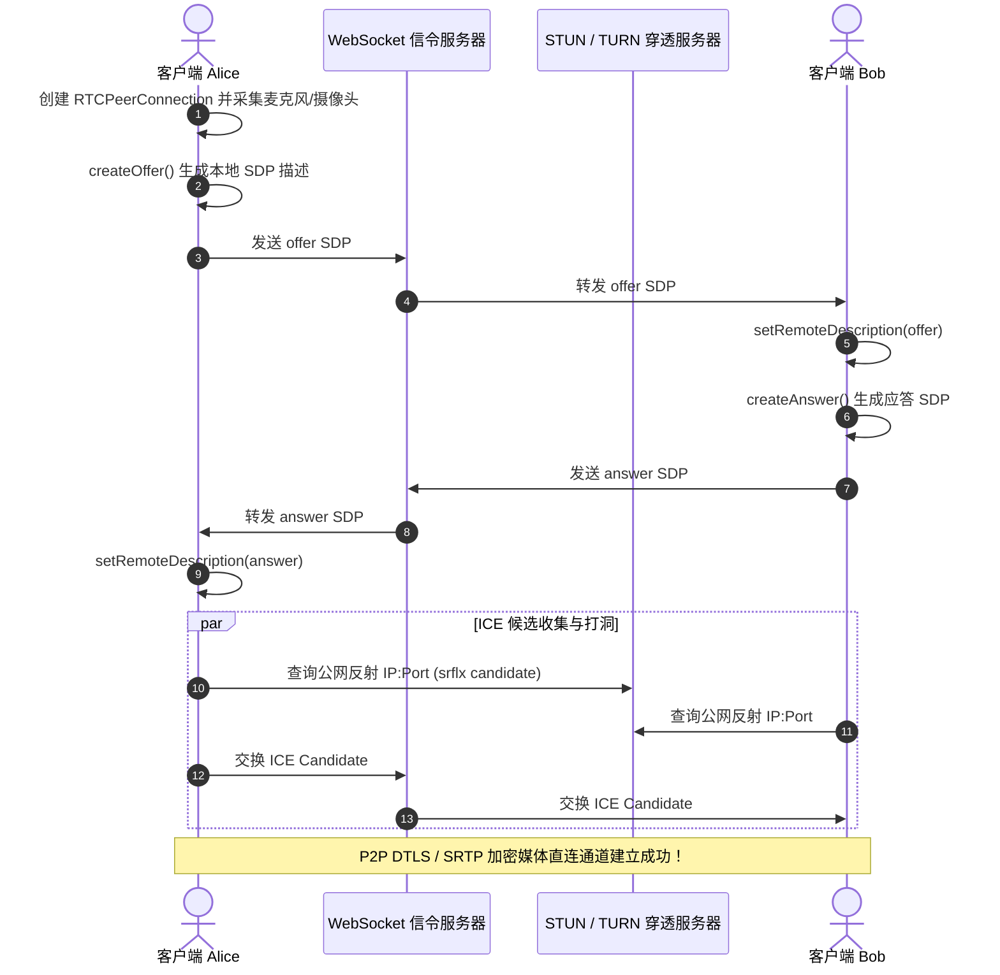

# WebRTC 实时音视频与 SFU 架构实战

在远程办公、在线协同课堂、互动直播等场景中，毫秒级（< 200ms）超低延迟的音视频互动是核心体验保障。**WebRTC (Web Real-Time Communication)** 作为 W3C 和 IETF 标准化的点对点实时通信技术，允许浏览器在无需安装任何插件的情况下实现音视频采集、编解码与安全传输。

然而，原生的 WebRTC P2P 模式仅适用于 1 对 1 双人通话。在 10 人以上的复杂多人会议或万人大班课中，必须依赖**流媒体服务器 (Media Server)**。**SFU (Selective Forwarding Unit，选择性转发单元)** 凭借低 CPU 开销与极高的并发转发能力，成为了现代实时流媒体架构的主流方案。

---

## 一、多人实时音视频三大架构模式对比

```mermaid
graph TD
    subgraph Mesh_Mode [1. Mesh 模式 (全互联 P2P)]
        M_User1[客户端 A] <--> M_User2[客户端 B]
        M_User1 <--> M_User3[客户端 C]
        M_User2 <--> M_User3
    end

    subgraph MCU_Mode [2. MCU 模式 (中心混流解码转码)]
        MCU_ClientA[客户端 A] --> MCU_Server["MCU 硬件/服务器 (重度混流编码)"]
        MCU_ClientB[客户端 B] --> MCU_Server
        MCU_Server --> SingleMix[合流单一视频流回传]
    end

    subgraph SFU_Mode [3. SFU 模式 (路由转发，零编解码消耗)]
        SFU_A[发布者 A] --> SFU_Node[SFU 路由分发核心]
        SFU_Node --> SubB["订阅者 B: 按需拉取高清/标清"]
        SFU_Node --> SubC["订阅者 C: 按需拉取高清/标清"]
    end
```

| 架构类型 | 客户端上行带宽压力 | 服务端 CPU 计算损耗 | 延迟表现 | 适用规模 |
| :--- | :--- | :--- | :--- | :--- |
| **Mesh (P2P)** | 极高（需向每个与会者单独推流，复杂度 $O(N^2)$） | **0**（无服务端） | 极低 | $\le 4$ 人极小范围通话 |
| **MCU (混流)** | 极低（仅需推 1 路，收 1 融合流） | **极高**（需对所有视频进行硬件解码、画面拼接与重新编码） | 较高（增加混流转码延迟） | 传统专网硬件视频会议 |
| **SFU (转发)** | **极低（仅需推 1 路上行）** | **极低**（仅做 RTP/RTCP 路由转发，不解码媒体帧） | **极低 (< 100ms)** | **几百至数万人大规模互动** |

---

## 二、WebRTC 建立连接全生命周期：信令与 ICE 穿透

WebRTC 本身没有规定信令协议，通常使用 WebSocket 交换元数据：



---

## 三、基于 Mediasoup SFU 的 Node.js 核心服务端实现

Mediasoup 采用 Node.js 作为信令控制面、C++ 核心工作进程处理高吞吐 RTP 数据包，架构极为高效：

```typescript
// server/sfu-room.ts
import * as mediasoup from 'mediasoup';

export class SfuRoom {
  private worker!: mediasoup.types.Worker;
  private router!: mediasoup.types.Router;
  private transports = new Map<string, mediasoup.types.WebRtcTransport>();
  private producers = new Map<string, mediasoup.types.Producer>();
  private consumers = new Map<string, mediasoup.types.Consumer>();

  async init() {
    // 启动底层的 C++ mediasoup Worker 进程
    this.worker = await mediasoup.createWorker({
      rtcMinPort: 20000,
      rtcMaxPort: 20200,
    });

    // 创建媒体路由器，声明支持的音视频编解码器 (Opus & VP8/H264)
    this.router = await this.worker.createRouter({
      mediaCodecs: [
        {
          kind: 'audio',
          mimeType: 'audio/opus',
          clockRate: 48000,
          channels: 2,
        },
        {
          kind: 'video',
          mimeType: 'video/VP8',
          clockRate: 90000,
        },
      ],
    });
  }

  // 为客户端创建 WebRtcTransport 通道
  async createTransport(clientId: string) {
    const transport = await this.router.createWebRtcTransport({
      listenIps: [{ ip: '0.0.0.0', announcedIp: '198.51.100.1' }],
      enableUdp: true,
      enableTcp: true,
      preferUdp: true,
    });

    this.transports.set(transport.id, transport);
    return {
      id: transport.id,
      iceParameters: transport.iceParameters,
      iceCandidates: transport.iceCandidates,
      dtlsParameters: transport.dtlsParameters,
    };
  }

  // 消费某位发言人的音视频流 (转发)
  async consumeStream(consumerTransportId: string, producerId: string, rtpCapabilities: mediasoup.types.RtpCapabilities) {
    if (!this.router.canConsume({ producerId, rtpCapabilities })) {
      throw new Error('Cannot consume this producer');
    }

    const transport = this.transports.get(consumerTransportId);
    const consumer = await transport!.consume({
      producerId,
      rtpCapabilities,
      paused: false,
    });

    this.consumers.set(consumer.id, consumer);
    return {
      id: consumer.id,
      producerId,
      kind: consumer.kind,
      rtpParameters: consumer.rtpParameters,
    };
  }
}
```

---

## 四、弱网流控与服务可用性保障

1. **Simulcast (大小流多分辨率推流)**：发布端同时编码推送 720P、360P、180P 三档视频流，SFU 依据各订阅者的网络带宽状况与视窗尺寸，动态选择转发最适配的一档流。
2. **拥塞控制 (GCC / BBR)** 与 **重传 (NACK / PLI)**：利用 RTCP 反馈包动态估算链路带宽，若检测到轻微丢包，由 SFU 缓存队列直接重发 RTP 包，无需发布者重发。
