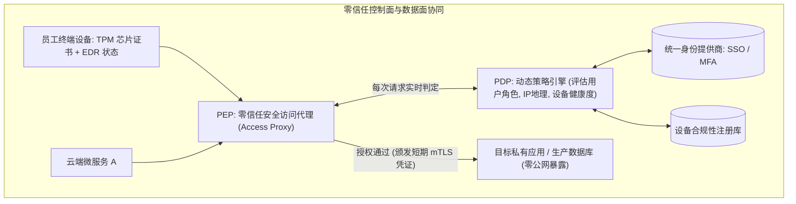
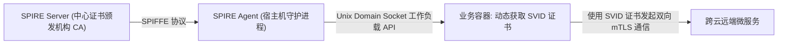

# 跨云零信任网络架构落地实践

在传统的企业网络安全架构中，普遍遵循“**城堡与护城河 (Castle-and-Moat)**”边界安全模型：企业通过防火墙与 VPN 划定一个被信任的内网边界，任何用户一旦通过 VPN 拨入内网，便被默认赋予了广泛的内网横向访问权限。

然而，随着跨多云基础设施（AWS + 阿里云 + 本地机房）与混合办公的普及，物理网络边界已彻底瓦解。黑客一旦攻破单台边界内网机器（如内网钓鱼、弱密码跳板），即可在内网肆意横向移动（Lateral Movement）。

**零信任网络架构 (Zero Trust Architecture, ZTA)** 秉持 **“持续验证，永不信任 (Never Trust, Always Verify)”** 的核心理念，将安全策略从传统的“网络位置（IP/VLAN）”重构为**基于上下文的强身份认证与动态细粒度权限控制**。

---

## 一、传统边界模型 vs 零信任架构全方位对比

| 架构特性 | 传统边界安全模型 (VPN / 城堡护城河) | 现代化零信任架构 (BeyondCorp / SDP) |
| :--- | :--- | :--- |
| **信任假设** | 默认信任内网中的所有主机与流量 | **默认任何网络位置均不可信（即使在同一个数据中心机架内）** |
| **访问控制粒度** | 粗粒度基于网络层 IP 范围、子网与端口 | **应用层与服务级细粒度隔离（仅允许访问特定 API，严禁内网漫游）** |
| **身份校验时机** | 单次在登录 VPN 入口时进行认证 | **对每一次请求进行持续动态评估（设备合规性 + 用户身份 + 行为风险）** |
| **数据链路保护** | 内网内部明文通信（无加密） | **全链路强制双向 mTLS 加密与短暂临时证书签发** |



---

## 二、工作负载身份体系：SPIFFE / SPIRE 跨云互信实战

在跨越 AWS、Kubernetes 与本地 IDC 的混合云环境中，服务与服务之间的通信不能依赖固定的 IP 白名单。

**SPIFFE (Secure Production Identity Framework for Everyone)** 定义了云原生工作负载的标准身份规范，通过 **SPIRE** 运行时自动为每个容器/虚拟机颁发短期的 **SVID (X.509 证书 / JWT)**：



### SPIFFE ID 统一命名规范：
```text
spiffe://enterprise.org/ns/production/sa/payment-service
\_____________________/ \____________________________/
       信任域 (Trust Domain)             工作负载唯一标识
```

---

## 三、软件定义边界 (SDP) 与微隔离 (Micro-segmentation) 落地

利用网络代理或 eBPF 实现主机间的 **微隔离**，彻底阻断黑客横向渗透路径：

```yaml
# 声明式微隔离访问策略定义 (仅允许特定服务在特定端口通信)
apiVersion: security.enterprise.org/v1
kind: MicrosegmentationPolicy
metadata:
  name: order-to-payment-policy
spec:
  source:
    spiffeId: "spiffe://enterprise.org/ns/prod/sa/order-service"
  destination:
    spiffeId: "spiffe://enterprise.org/ns/prod/sa/payment-service"
    allowedPorts: [8443]
    allowedMethods: ["POST /api/v1/charge"] # 应用层 API 级别的精准白名单
  action: ALLOW
```

---

## 四、企业零信任演进四大里程碑

1. **第一阶段：应用访问全面收口代理 (Access Proxy)**：废弃传统厚客户端 VPN，全量员工通过基于 Web 的身份感知代理（如 Cloudflare Access, Google BeyondCorp Enterprise）单点登录访问内网系统。
2. **第二阶段：设备可信绑定与合规探测**：未安装企业 EDR 杀毒软件、未开启全盘加密或操作系统存在未修补高危补丁的私有电脑，直接降级或阻断访问。
3. **第三阶段：服务间全量 mTLS 加密与工作负载自动化身份注册**。
4. **第四阶段：动态风险评分与会话自适应降权**：若检测到用户在 10 分钟内分别从北京和纽约发起登录，立即触发二次 MFA 挑战或主动熔断会话。
